# 一、java

Java 本身是一种面向对象的语言，最显著的特性有两个方面，一是所谓的“书写一次，到处运行”（Write once, run anywhere），能够非常容易地获得跨平台能力；另外就是垃圾收集（GC, Garbage Collection），Java 通过垃圾收集器（Garbage Collector）回收分配内存，大部分情况下，程序员不需要自己操心内存的分配和回收。

我们日常会接触到 JRE（Java Runtime Environment）或者 JDK（Java Development Kit）。 JRE，也就是 Java 运行环境，包含了 JVM 和 Java 类库，以及一些模块等。而 JDK 可以看作是 JRE 的一个超集，提供了更多工具，比如编译器、各种诊断工具等。

对于“Java 是解释执行”这句话，这个说法不太准确。我们开发的 Java 的源代码，首先通过 Javac 编译成为字节码（bytecode），然后，在运行时，通过 Java 虚拟机（JVM）内嵌的解释器将字节码转换成为最终的机器码。但是常见的 JVM，比如我们大多数情况使用的 Oracle JDK 提供的 Hotspot JVM，都提供了 JIT（Just-In-Time）编译器，也就是通常所说的动态编译器，JIT 能够在运行时将热点代码编译成机器码，这种情况下部分热点代码就属于编译执行，而不是解释执行了。

### 1.1 接口和抽象
接口和抽象类是 Java 面向对象设计的两个基础机制。
* 接口是对行为的抽象，它是抽象方法的集合，利用接口可以达到 API 定义和实现分离的目的。接口，不能实例化；不能包含任何非常量成员，任何 field 都是隐含着 public static final 的意义；同时，没有非静态方法实现，也就是说要么是抽象方法，要么是静态方法。Java 标准类库中，定义了非常多的接口，比如 java.util.List。

* 抽象类是不能实例化的类，用 abstract 关键字修饰 class，其目的主要是代码重用。除了不能实例化，形式上和一般的 Java 类并没有太大区别，可以有一个或者多个抽象方法，也可以没有抽象方法。抽象类大多用于抽取相关 Java 类的共用方法实现或者是共同成员变量，然后通过继承的方式达到代码复用的目的。Java 标准库中，比如 collection 框架，很多通用部分就被抽取成为抽象类，例如 java.util.AbstractList。

Java 类实现 interface 使用 implements 关键词，继承 abstract class 则是使用 extends 关键词，我们可以参考 Java 标准库中的 ArrayList。

Java 相比于其他面向对象语言，如 C++，设计上有一些基本区别，比如Java 不支持多继承。这种限制，在规范了代码实现的同时，也产生了一些局限性，影响着程序设计结构。Java 类可以实现多个接口，因为接口是抽象方法的集合，所以这是声明性的，但不能通过扩展多个抽象类来重用逻辑。有一类没有任何方法的接口，通常叫作 Marker Interface，顾名思义，它的目的就是为了声明某些东西，比如我们熟知的 Cloneable、Serializable 等。这种用法，也存在于业界其他的 Java 产品代码中。从 Java 8 开始，interface 增加了对 default method 的支持。

#### 1.1.1 封装、继承、多态

* 封装的目的是隐藏事务内部的实现细节，以便提高安全性和简化编程。封装提供了合理的边界，避免外部调用者接触到内部的细节。我们在日常开发中，因为无意间暴露了细节导致的难缠 bug 太多了，比如在多线程环境暴露内部状态，导致的并发修改问题。从另外一个角度看，封装这种隐藏，也提供了简化的界面，避免太多无意义的细节浪费调用者的精力。

* 继承是代码复用的基础机制，类似于我们对于马、白马、黑马的归纳总结。但要注意，继承可以看作是非常紧耦合的一种关系，父类代码修改，子类行为也会变动。在实践中，过度滥用继承，可能会起到反效果。

* 多态，你可能立即会想到重写（override）和重载（overload）、向上转型。简单说，重写是父子类中相同名字和参数的方法，不同的实现；重载则是相同名字的方法，但是不同的参数，本质上这些方法签名是不一样的，为了更好说明，请参考下面的样例代码：

### 1.2 设计模式
设计模式是人们为软件开发中相同表征的问题，抽象出的可重复利用的解决方案。在某种程度上，设计模式已经代表了一些特定情况的最佳实践，同时也起到了软件工程师之间沟通的“行话”的作用。理解和掌握典型的设计模式，有利于我们提高沟通、设计的效率和质量。同时编写代码的时候我们要遵循以下设计原则：
* 单一职责（Single Responsibility），类或者对象最好是只有单一职责，在程序设计中如果发现某个类承担着多种义务，可以考虑进行拆分。
* 开关原则（Open-Close, Open for extension, close for modification），设计要对扩展开放，对修改关闭。换句话说，程序设计应保证平滑的扩展性，尽量避免因为新增同类功能而修改已有实现，这样可以少产出些回归（regression）问题。
* 里氏替换（Liskov Substitution），这是面向对象的基本要素之一，进行继承关系抽象时，凡是可以用父类或者基类的地方，都可以用子类替换。
* 接口分离（Interface Segregation），我们在进行类和接口设计时，如果在一个接口里定义了太多方法，其子类很可能面临两难，就是只有部分方法对它是有意义的，这就破坏了程序的内聚性。
对于这种情况，可以通过拆分成功能单一的多个接口，将行为进行解耦。在未来维护中，如果某个接口设计有变，不会对使用其他接口的子类构成影响。
* 依赖反转（Dependency Inversion），实体应该依赖于抽象而不是实现。也就是说高层次模块，不应该依赖于低层次模块，而是应该基于抽象。实践这一原则是保证产品代码之间适当耦合度的法宝。

大致按照模式的应用目标分类，设计模式可以分为创建型模式、结构型模式和行为型模式。

* 创建型模式，是对对象创建过程的各种问题和解决方案的总结，包括各种工厂模式（Factory、Abstract Factory）、单例模式（Singleton）、构建器模式（Builder）、原型模式（ProtoType）。
* 结构型模式，是针对软件设计结构的总结，关注于类、对象继承、组合方式的实践经验。常见的结构型模式，包括桥接模式（Bridge）、适配器模式（Adapter）、装饰者模式（Decorator）、代理模式（Proxy）、组合模式（Composite）、外观模式（Facade）、享元模式（Flyweight）等。
* 行为型模式，是从类或对象之间交互、职责划分等角度总结的模式。比较常见的行为型模式有策略模式（Strategy）、解释器模式（Interpreter）、命令模式（Command）、观察者模式（Observer）、迭代器模式（Iterator）、模板方法模式（Template Method）、访问者模式（Visitor）。

我们知道 InputStream 是一个抽象类，标准类库中提供了 FileInputStream、ByteArrayInputStream 等各种不同的子类，分别从不同角度对 InputStream 进行了功能扩展，这是典型的装饰器模式应用案例。

JDK 最新版本中 HTTP/2 Client API，下面这个创建 HttpRequest 的过程，就是典型的构建器模式（Builder），通常会被实现成fluent 风格的 API，也有人叫它方法链。还有lombok对象的创建方式。

单例模式方式列举例：
``` java
// 通过一个双重检查单例模式来说明
public class Singleton {
  static Singleton instance;
  static Singleton getInstance(){
    if (instance == null) {
      synchronized(Singleton.class) {
        if (instance == null)
          instance = new Singleton();
        }
    }
    return instance;
  }
}

// 现行的比较通用的做法就是采用静态内部类的方式来实现。
public class MySingleton {
    // 内部类
    private static class MySingletonHandler{
        private static MySingleton instance = new MySingleton();
    }
    
    private MySingleton(){}
     
    public static MySingleton getInstance() {
        return MySingletonHandler.instance;
    }
}

// 枚举实现单例模式：
class Resource{
}
public enum SomeThing {
    INSTANCE;
    private Resource instance;
    SomeThing() {
        instance = new Resource();
    }
    public Resource getInstance() {
        return instance;
    }
}
// 单例模式：懒汉模式，饿汉模式，双重检锁模式（jdk1.5后支持），枚举单例模式，类级内部类，容器单例模式，
```

### 1.3 JVM
Java 通过引入字节码和 JVM 机制，提供了强大的跨平台能力，理解 Java 的类加载机制是深入 Java 开发的必要条件，也是个面试考察热点。

#### 1.3.1 类加载

Java 的类加载过程分为三个主要步骤：加载、链接、初始化。

**加载阶段（Loading）**，它是 Java 将字节码数据从不同的数据源读取到 JVM 中，并映射为 JVM 认可的数据结构（Class 对象），这里的数据源可能是各种各样的形态，如 jar 文件、class 文件，甚至是网络数据源等；如果输入数据不是 ClassFile 的结构，则会抛出 ClassFormatError。加载阶段是用户参与的阶段，我们可以自定义类加载器，去实现自己的类加载过程。
**链接（Linking）**，这是核心的步骤，简单说是把原始的类定义信息平滑地转化入 JVM 运行的过程中。这里可进一步细分为三个步骤：

* 验证（Verification），这是虚拟机安全的重要保障，JVM 需要核验字节信息是符合 Java 虚拟机规范的，否则就被认为是 VerifyError，这样就防止了恶意信息或者不合规的信息危害 JVM 的运行，验证阶段有可能触发更多 class 的加载。
* 准备（Preparation），创建类或接口中的静态变量，并初始化静态变量的初始值。但这里的“初始化”和下面的显式初始化阶段是有区别的，侧重点在于分配所需要的内存空间，不会去执行更进一步的 JVM 指令。
* 解析（Resolution），在这一步会将常量池中的符号引用（symbolic reference）替换为直接引用。在Java 虚拟机规范中，详细介绍了类、接口、方法和字段等各个方面的解析。

**初始化阶段（initialization）**，这一步真正去执行类初始化的代码逻辑，包括静态字段赋值的动作，以及执行类定义中的静态初始化块内的逻辑，编译器在编译阶段就会把这部分逻辑整理好，父类型的初始化逻辑优先于当前类型的逻辑。

双亲委派模型：简单说就是当类加载器（Class-Loader）试图加载某个类型的时候，除非父加载器找不到相应类型，否则尽量将这个任务代理给当前加载器的父加载器去做。使用委派模型的目的是避免重复加载 Java 类型。

#### 1.3.2 类加载器
* 启动类加载器（Bootstrap Class-Loader），加载 jre/lib 下面的 jar 文件，如 rt.jar。它是个超级公民，即使是在开启了 Security Manager 的时候，JDK 仍赋予了它加载的程序 AllPermission，我们可以通过修改启动参数替换指定的Java包，到bootclasspath，甚至可以指定前置加载或者后置加载，配置方式如下：
``` java 
# 指定新的 bootclasspath，替换 java.* 包的内部实现
java -Xbootclasspath:<your_boot_classpath> your_App
 
# a 意味着 append，将指定目录添加到 bootclasspath 后面
java -Xbootclasspath/a:<your_dir> your_App
 
# p 意味着 prepend，将指定目录添加到 bootclasspath 前面
java -Xbootclasspath/p:<your_dir> your_App

# JDK 9 中，由于 Jigsaw 项目引入了 Java 平台模块化系统（JPMS），Java SE 的源代码被划分为一系列模块。 -Xbootclasspath 参数不可用了，可以用以下参数配置
java --patch-module java.base=your_patch yourApp
```
* 扩展类加载器（Extension or Ext Class-Loader），负责加载我们放到 jre/lib/ext/ 目录下面的 jar 包，这就是所谓的 extension 机制。该目录也可以通过设置 “java.ext.dirs”来覆盖。`java -Djava.ext.dirs=your_ext_dir HelloWorld`
* 应用类加载器（Application or App Class-Loader），就是加载我们最熟悉的 classpath 的内容。这里有一个容易混淆的概念，系统（System）类加载器，通常来说，其默认就是 JDK 内建的应用类加载器，但是它同样是可能修改的，比如：`java -Djava.system.class.loader=com.yourcorp.YourClassLoader HelloWorld`如果我们指定了这个参数，JDK 内建的应用类加载器就会成为定制加载器的父亲，这种方式通常用在类似需要改变双亲委派模式的场景。

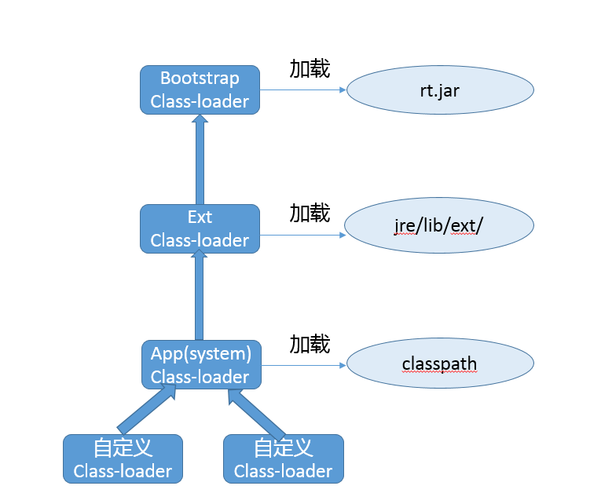

如果不同类加载器都自己加载需要的某个类型，那么就会出现多次重复加载，完全是种浪费，所以便有了双亲委派模型。但不是所有类加载都遵守这个模型，有的时候，启动类加载器所加载的类型，是可能要加载用户代码的，比如 JDK 内部的 ServiceProvider/ServiceLoader机制，用户可以在标准 API 框架上，提供自己的实现，JDK 也需要提供些默认的参考实现。 例如，Java 中 JNDI、JDBC、文件系统、Cipher 等很多方面，都是利用的这种机制，这种情况就不会用双亲委派模型去加载，而是利用所谓的上下文加载器。
子类加载器可以访问父加载器加载的类型，但是反过来是不允许的，不然，因为缺少必要的隔离，我们就没有办法利用类加载器去实现容器的逻辑。由于父加载器的类型对于子加载器是可见的，所以父加载器中加载过的类型，就不会在子加载器中重复加载。但是注意，类加载器“邻居”间，同一类型仍然可以被加载多次，因为互相并不可见。

JDK 9 中 Jigsaw 项目引入了 Java 平台模块化系统（JPMS）扩展类加载器被重命名为平台类加载器（Platform Class-Loader），而且 extension 机制则被移除。也就意味着，如果我们指定 java.ext.dirs 环境变量，或者 lib/ext 目录存在，JVM 将直接返回错误！建议解决办法就是将其放入 classpath 里。
部分不需要 AllPermission 的 Java 基础模块，被降级到平台类加载器中，相应的权限也被更精细粒度地限制起来。rt.jar 和 tools.jar 同样是被移除了！JDK 的核心类库以及相关资源，被存储在 jimage 文件中，并通过新的 JRT 文件系统访问，而不是原有的 JAR 文件系统。虽然看起来很惊人，但幸好对于大部分软件的兼容性影响，其实是有限的，更直接地影响是 IDE 等软件，通常只要升级到新版本就可以了。
增加了 Layer 的抽象， JVM 启动默认创建 BootLayer，开发者也可以自己去定义和实例化 Layer，可以更加方便的实现类似容器一般的逻辑抽象。
结合了 Layer，目前的 JVM 内部结构就变成了下面的层次，内建类加载器都在 BootLayer 中，其他 Layer 内部有自定义的类加载器，不同版本模块可以同时工作在不同的 Layer。

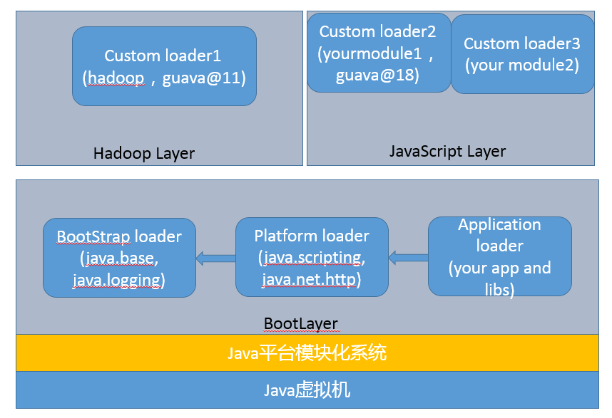

自定义类加载器，常见的场景有：
* 实现类似进程内隔离，用不同的命名空间加载某个类库的不同版本，
* 应用需要从不同的数据源获取类定义信息，例如网络数据源，而不是本地文件系统
* 或者是需要自己操纵字节码，动态修改或者生成类型。

自定义加载器加载过程：通过指定名称，找到其二进制实现（java 字节码文件），然后，创建 Class 对象，并完成类加载过程。二进制信息到 Class 对象的转换，通常就依赖defineClass，我们无需自己实现，它是 final 方法。

除了类加载器加载Java对象，我们可以在Java运行期间动态的加载Java对象。
* 生成字节码：JDK 内部就集成了 ASM 类库，虽然并未作为公共 API 暴露出来，通过ASM动态生成字节码。
* 字节码到对象：通过sun.misc.Unsafe类中defineClass、defineAnonymousClass方法实现
``` java
public native Class<?> defineClass(String var1, byte[] var2, int var3, int var4, ClassLoader var5, ProtectionDomain var6);
public native Class<?> defineAnonymousClass(Class<?> var1, byte[] var2, Object[] var3);
// ... 其他重载方法实现
```

#### 1.3.3 JVM内存划分

* 程序计数器（PC，Program Counter Register）。在 JVM 规范中，每个线程都有它自己的程序计数器，并且任何时间一个线程都只有一个方法在执行，也就是所谓的当前方法。程序计数器会存储当前线程正在执行的 Java 方法的 JVM 指令地址；或者，如果是在执行本地方法，则是未指定值（undefined）。

* Java 虚拟机栈（Java Virtual Machine Stack），早期也叫 Java 栈。每个线程在创建时都会创建一个虚拟机栈，其内部保存一个个的栈帧（Stack Frame），对应着一次次的 Java 方法调用。在一个时间点，对应的只会有一个活动的栈帧，通常叫作当前帧，方法所在的类叫作当前类。如果在该方法中调用了其他方法，对应的新的栈帧会被创建出来，成为新的当前帧，一直到它返回结果或者执行结束。JVM 直接对 Java 栈的操作只有两个，就是对栈帧的压栈和出栈。栈帧中存储着局部变量表、操作数（operand）栈、动态链接、方法正常退出或者异常退出的定义等。

* 堆（Heap），它是 Java 内存管理的核心区域，用来放置 Java 对象实例，几乎所有创建的 Java 对象实例都是被直接分配在堆上。堆被所有的线程共享，在虚拟机启动时，我们指定的“Xmx”之类参数就是用来指定最大堆空间等指标。理所当然，堆也是垃圾收集器重点照顾的区域，所以堆内空间还会被不同的垃圾收集器进行进一步的细分，最有名的就是新生代、老年代的划分。

* 方法区（Method Area）。这也是所有线程共享的一块内存区域，用于存储所谓的元（Meta）数据，例如类结构信息，以及对应的运行时常量池、字段、方法代码等。由于早期的 Hotspot JVM 实现，很多人习惯于将方法区称为永久代（Permanent Generation）。Oracle JDK 8 中将永久代移除，同时增加了元数据区（Metaspace）。

* 运行时常量池（Run-Time Constant Pool），这是方法区的一部分。如果仔细分析过反编译的类文件结构，你能看到版本号、字段、方法、超类、接口等各种信息，还有一项信息就是常量池。Java 的常量池可以存放各种常量信息，不管是编译期生成的各种字面量，还是需要在运行时决定的符号引用，所以它比一般语言的符号表存储的信息更加宽泛。

* 本地方法栈（Native Method Stack）。它和 Java 虚拟机栈是非常相似的，支持对本地方法的调用，也是每个线程都会创建一个。在 Oracle Hotspot JVM 中，本地方法栈和 Java 虚拟机栈是在同一块儿区域，这完全取决于技术实现的决定，并未在规范中强制。

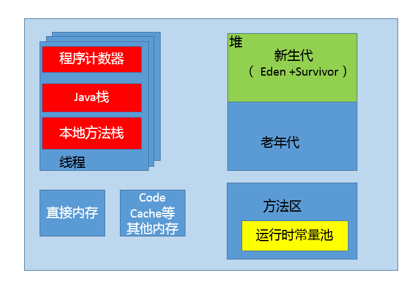

- 直接内存（Direct Memory 内核空间）区域，在 JVM 工程师的眼中，并不认为它是 JVM 内部内存的一部分，也并未体现 JVM 内存模型中。
- JVM 本身是个本地程序，还需要其他的内存去完成各种基本任务，比如，JIT Compiler 在运行时对热点方法进行编译，就会将编译后的方法储存在 Code Cache 里面；GC 等功能需要运行在本地线程之中，类似部分都需要占用内存空间。这些是实现 JVM JIT 等功能的需要，但规范中并不涉及。

对于堆内存，我在上一讲介绍了最常见的新生代和老年代的划分，其内部结构随着 JVM 的发展和新 GC 方式的引入，可以有不同角度的理解，下图就是年代视角的堆结构示意图。

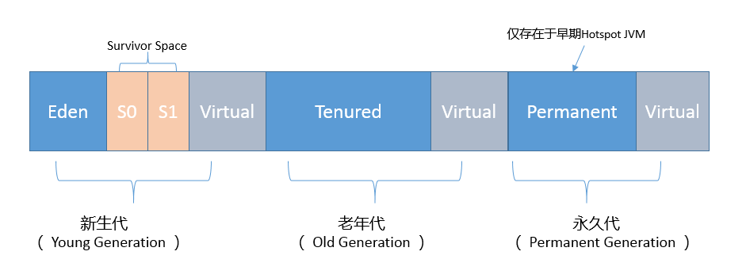

新生代：新生代是大部分对象创建和销毁的区域，在通常的 Java 应用中，绝大部分对象生命周期都是很短暂的。其内部又分为 Eden 区域，作为对象初始分配的区域；两个 Survivor，有时候也叫 from、to 区域，被用来放置从 Minor GC 中保留下来的对象。

JVM 会随意选取一个 Survivor 区域作为“to”，然后会在 GC 过程中进行区域间拷贝，也就是将 Eden 中存活下来的对象和 from 区域的对象，拷贝到这个“to”区域。这种设计主要是为了防止内存的碎片化，并进一步清理无用对象。
从内存模型而不是垃圾收集的角度，对 Eden 区域继续进行划分，Hotspot JVM 还有一个概念叫做 Thread Local Allocation Buffer（TLAB），据我所知所有 OpenJDK 衍生出来的 JVM 都提供了 TLAB 的设计。这是 JVM 为每个线程分配的一个私有缓存区域，否则，多线程同时分配内存时，为避免操作同一地址，可能需要使用加锁等机制，进而影响分配速度，你可以参考下面的示意图。从图中可以看出，TLAB 仍然在堆上，它是分配在 Eden 区域内的。其内部结构比较直观易懂，start、end 就是起始地址，top（指针）则表示已经分配到哪里了。所以我们分配新对象，JVM 就会移动 top，当 top 和 end 相遇时，即表示该缓存已满，JVM 会试图再从 Eden 里分配一块儿。

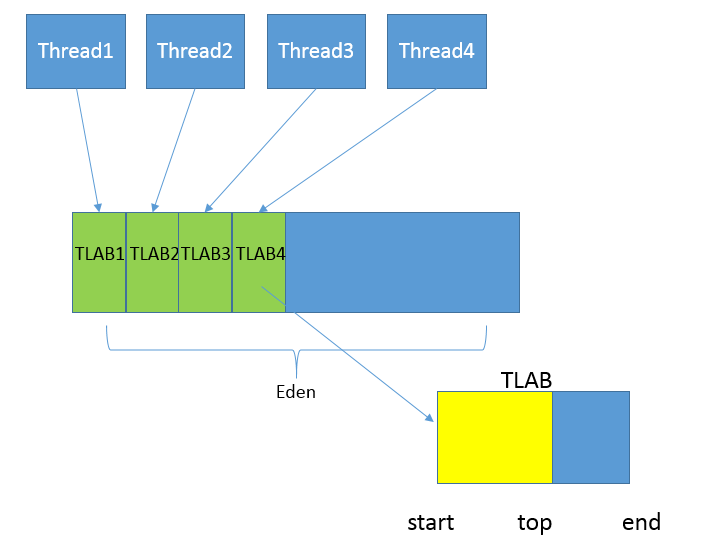

老年代：放置长生命周期的对象，通常都是从 Survivor 区域拷贝过来的对象。当然，也有特殊情况，我们知道普通的对象会被分配在 TLAB 上；如果对象较大，JVM 会试图直接分配在 Eden 其他位置上；如果对象太大，完全无法在新生代找到足够长的连续空闲空间，JVM 就会直接分配到老年代。

永久代：这部分就是早期 Hotspot JVM 的方法区实现方式了，储存 Java 类元数据、常量池、Intern 字符串缓存，在 JDK 8 之后就不存在永久代这块儿了。

Virtual：我在年代视角的堆结构示意图也就是第一张图中，还标记出了 Virtual 区域，在 JVM 内部，如果 Xms 小于 Xmx，堆的大小并不会直接扩展到其上限，也就是说保留的空间（reserved）大于实际能够使用的空间（committed）。当内存需求不断增长的时候，JVM 会逐渐扩展新生代等区域的大小，所以 Virtual 区域代表的就是暂时不可用（uncommitted）的空间。


发生 OutOfMemoryError，简单总结如下：
* 堆内存不足是最常见的 OOM 原因之一，抛出的错误信息是“java.lang.OutOfMemoryError:Java heap space”，原因可能千奇百怪，例如，可能存在内存泄漏问题；也很有可能就是堆的大小不合理，比如我们要处理比较可观的数据量，但是没有显式指定 JVM 堆大小或者指定数值偏小；或者出现 JVM 处理引用不及时，导致堆积起来，内存无法释放等。
* 而对于 Java 虚拟机栈和本地方法栈，这里要稍微复杂一点。如果我们写一段程序不断的进行递归调用，而且没有退出条件，就会导致不断地进行压栈。类似这种情况，JVM 实际会抛出 StackOverFlowError；当然，如果 JVM 试图去扩展栈空间的的时候失败，则会抛出 OutOfMemoryError。
* 对于老版本的 Oracle JDK，因为永久代的大小是有限的，并且 JVM 对永久代垃圾回收（如，常量池回收、卸载不再需要的类型）非常不积极，所以当我们不断添加新类型的时候，永久代出现 OutOfMemoryError 也非常多见，尤其是在运行时存在大量动态类型生成的场合；类似 Intern 字符串缓存占用太多空间，也会导致 OOM 问题。对应的异常信息，会标记出来和永久代相关：“java.lang.OutOfMemoryError: PermGen space”。
* 随着元数据区的引入，方法区内存已经不再那么窘迫，所以相应的 OOM 有所改观，出现 OOM，异常信息则变成了：“java.lang.OutOfMemoryError: Metaspace”。
* 直接内存不足，也会导致 OOM。


#### 1.3.3 JVM性能调优
可以使用综合性的图形化工具，如 JConsole、VisualVM（注意，从 Oracle JDK 9 开始，VisualVM 已经不再包含在 JDK 安装包中）等，也可以使用命令行工具进行运行时查询，如 jstat 和 jmap 等工具可以查看堆、方法区等使用数据。或者，也可以使用 jmap 等提供的命令，生成堆转储（Heap Dump）文件，然后利用 jhat 或 Eclipse MAT 等堆转储分析工具进行详细分析。如果你使用的是 Tomcat、Weblogic 等 Java EE 服务器，这些服务器同样提供了内存管理相关的功能。

#### 1.3.4 垃圾收集器
垃圾收集器（GC，Garbage Collector）是和具体 JVM 实现紧密相关的，不同厂商（IBM、Oracle），不同版本的 JVM，提供的选择也不同。接下来，主流的是 Oracle JDK里的垃圾收集器。

* Serial GC，它是最古老的垃圾收集器，“Serial”体现在其收集工作是单线程的，并且在进行垃圾收集过程中，会进入臭名昭著的“Stop-The-World”状态。当然，其单线程设计也意味着精简的 GC 实现，无需维护复杂的数据结构，初始化也简单，所以一直是 Client 模式下 JVM 的默认选项。从年代的角度，通常将其老年代实现单独称作 Serial Old，它采用了标记 - 整理（Mark-Compact）算法，区别于新生代的复制算法。
Serial GC 的对应 JVM 参数是：`-XX:+UseSerialGC`
* ParNew GC，很明显是个新生代 GC 实现，它实际是 Serial GC 的多线程版本，最常见的应用场景是配合老年代的 CMS GC 工作，下面是对应参数`-XX:+UseConcMarkSweepGC -XX:+UseParNewGC`
* CMS（Concurrent Mark Sweep） GC，基于标记 - 清除（Mark-Sweep）算法，设计目标是尽量减少停顿时间，这一点对于 Web 等反应时间敏感的应用非常重要，一直到今天，仍然有很多系统使用 CMS GC。但是，CMS 采用的标记 - 清除算法，存在着内存碎片化问题，所以难以避免在长时间运行等情况下发生 full GC，导致恶劣的停顿。另外，既然强调了并发（Concurrent），CMS 会占用更多 CPU 资源，并和用户线程争抢。
* Parrallel GC，在早期 JDK 8 等版本中，它是 server 模式 JVM 的默认 GC 选择，也被称作是吞吐量优先的 GC。它的算法和 Serial GC 比较相似，尽管实现要复杂的多，其特点是新生代和老年代 GC 都是并行进行的，在常见的服务器环境中更加高效。开启选项是：`-XX:+UseParallelGC`
* G1 GC 这是一种兼顾吞吐量和停顿时间的 GC 实现，是 Oracle JDK 9 以后的默认 GC 选项。G1 可以直观的设定停顿时间的目标，相比于 CMS GC，G1 未必能做到 CMS 在最好情况下的延时停顿，但是最差情况要好很多。G1 GC 仍然存在着年代的概念，但是其内存结构并不是简单的条带式划分，而是类似棋盘的一个个 region。Region 之间是复制算法，但整体上实际可看作是标记 - 整理（Mark-Compact）算法，可以有效地避免内存碎片，尤其是当 Java 堆非常大的时候，G1 的优势更加明显。G1 吞吐量和停顿表现都非常不错，并且仍然在不断地完善，与此同时 CMS 已经在 JDK 9 中被标记为废弃（deprecated），所以 G1 GC 值得你深入掌握。

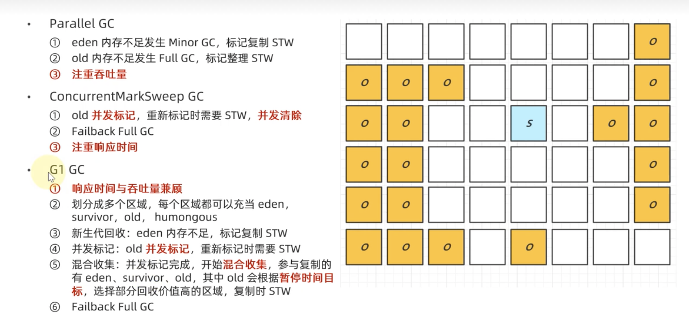

**如何确定回收对象**

* 引用计数算法，顾名思义，就是为对象添加一个引用计数，用于记录对象被引用的情况，如果计数为 0，即表示对象可回收。这是很多语言的资源回收选择，例如因人工智能而更加火热的 Python，它更是同时支持引用计数和垃圾收集机制。具体哪种最优是要看场景的，业界有大规模实践中仅保留引用计数机制，以提高吞吐量的尝试。Java 并没有选择引用计数，是因为其存在一个基本的难题，也就是很难处理循环引用关系。
* Java 选择的可达性分析，Java 的各种引用关系，在某种程度上，将可达性问题还进一步复杂化，这种类型的垃圾收集通常叫作追踪性垃圾收集（Tracing Garbage Collection）。其原理简单来说，就是将对象及其引用关系看作一个图，选定活动的对象作为 GC Roots，然后跟踪引用链条，如果一个对象和 GC Roots 之间不可达，也就是不存在引用链条，那么即可认为是可回收对象。JVM 会把虚拟机栈和本地方法栈中正在引用的对象、静态属性引用的对象和常量，作为 GC Roots。
方法区无用元数据的回收比较复杂，我简单梳理一下。还记得我对类加载器的分类吧，一般来说初始化类加载器加载的类型是不会进行类卸载（unload）的；而普通的类型的卸载，往往是要求相应自定义类加载器本身被回收，所以大量使用动态类型的场合，需要防止元数据区（或者早期的永久代）不会 OOM。在 8u40 以后的 JDK 中，下面参数已经是默认的：`-XX:+ClassUnloadingWithConcurrentMark`

**常见的垃圾收集算法**

* 复制（Copying）算法，我前面讲到的新生代 GC，基本都是基于复制算法，过程就如专栏上一讲所介绍的，将活着的对象复制到 to 区域，拷贝过程中将对象顺序放置，就可以避免内存碎片化。这么做的代价是，既然要进行复制，既要提前预留内存空间，有一定的浪费；另外，对于 G1 这种分拆成为大量 region 的 GC，复制而不是移动，意味着 GC 需要维护 region 之间对象引用关系，这个开销也不小，不管是内存占用或者时间开销。
* 标记 - 清除（Mark-Sweep）算法，首先进行标记工作，标识出所有要回收的对象，然后进行清除。这么做除了标记、清除过程效率有限，另外就是不可避免的出现碎片化问题，这就导致其不适合特别大的堆；否则，一旦出现 Full GC，暂停时间可能根本无法接受。
* 标记 - 整理（Mark-Compact），类似于标记 - 清除，但为避免内存碎片化，它会在清理过程中将对象移动，以确保移动后的对象占用连续的内存空间。
这些只是基本的算法思路，实际 GC 实现过程要复杂的多，目前还在发展中的前沿 GC 都是复合算法，并且并行和并发兼备。

**垃圾收集过程**

第一，Java 应用不断创建对象，通常都是分配在 Eden 区域，当其空间占用达到一定阈值时，触发 minor GC。仍然被引用的对象（绿色方块）存活下来，被复制到 JVM 选择的 Survivor 区域，而没有被引用的对象（黄色方块）则被回收。注意，我给存活对象标记了“数字 1”，这是为了表明对象的存活时间。

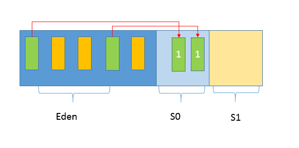

第二， 经过一次 Minor GC，Eden 就会空闲下来，直到再次达到 Minor GC 触发条件，这时候，另外一个 Survivor 区域则会成为 to 区域，Eden 区域的存活对象和 From 区域对象，都会被复制到 to 区域，并且存活的年龄计数会被加 1。

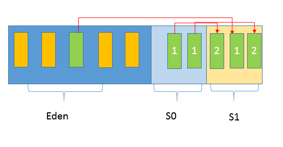

第三， 类似第二步的过程会发生很多次，直到有对象年龄计数达到阈值，这时候就会发生所谓的晋升（Promotion）过程，如下图所示，超过阈值的对象会被晋升到老年代。这个阈值是可以通过参数指定：`-XX:MaxTenuringThreshold=<N>`

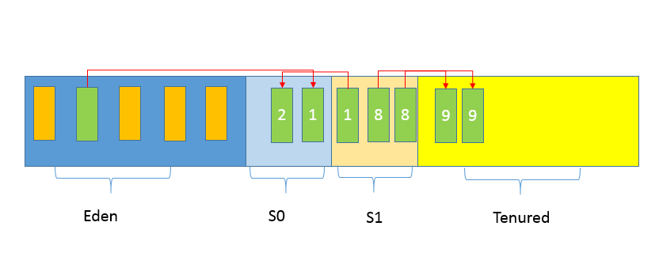

后面就是老年代 GC，具体取决于选择的 GC 选项，对应不同的算法。下面是一个简单标记 - 整理算法过程示意图，老年代中的无用对象被清除后， GC 会将对象进行整理，以防止内存碎片化。

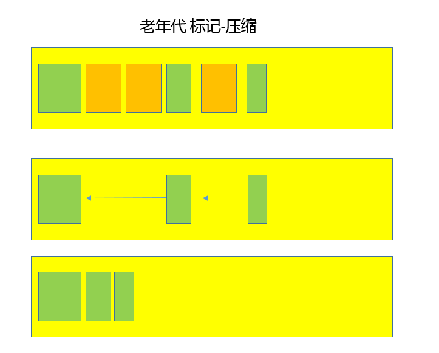

通常我们把老年代 GC 叫作 Major GC，将对整个堆进行的清理叫作 Full GC，但是这个也没有那么绝对，因为不同的老年代 GC 算法其实表现差异很大，例如 CMS，“concurrent”就体现在清理工作是与工作线程一起并发运行的。

**GC 的新发展**

JDK 11中，JDK 又增加了两种全新的 GC 方式，分别是：

- Epsilon GC，简单说就是个不做垃圾收集的 GC，似乎有点奇怪，有的情况下，例如在进行性能测试的时候，可能需要明确判断 GC 本身产生了多大的开销，这就是其典型应用场景。
- ZGC，这是 Oracle 开源出来的一个超级 GC 实现，具备令人惊讶的扩展能力，比如支持 T bytes 级别的堆大小，并且保证绝大部分情况下，延迟都不会超过 10 ms。虽然目前还处于实验阶段，仅支持 Linux 64 位的平台，但其已经表现出的能力和潜力都非常令人期待。

#### 1.3.5 垃圾收集调优

对于 GC 调优来说，首先就需要清楚调优的目标是什么？从性能的角度看，通常关注三个方面，内存占用（footprint）、延时（latency）和吞吐量（throughput），大多数情况下调优会侧重于其中一个或者两个方面的目标，很少有情况可以兼顾三个不同的角度。当然，除了上面通常的三个方面，也可能需要考虑其他 GC 相关的场景，例如，OOM 也可能与不合理的 GC 相关参数有关；或者，应用启动速度方面的需求，GC 也会是个考虑的方面。

基本的调优思路可以总结为：
* 理解应用需求和问题，确定调优目标。假设，我们开发了一个应用服务，但发现偶尔会出现性能抖动，出现较长的服务停顿。评估用户可接受的响应时间和业务量，将目标简化为，希望 GC 暂停尽量控制在 200ms 以内，并且保证一定标准的吞吐量。
* 掌握 JVM 和 GC 的状态，定位具体的问题，确定真的有 GC 调优的必要。具体有很多方法，比如，通过 jstat 等工具查看 GC 等相关状态，可以开启 GC 日志，或者是利用操作系统提供的诊断工具等。例如，通过追踪 GC 日志，就可以查找是不是 GC 在特定时间发生了长时间的暂停，进而导致了应用响应不及时。
* 这里需要思考，选择的 GC 类型是否符合我们的应用特征，如果是，具体问题表现在哪里，是 Minor GC 过长，还是 Mixed GC 等出现异常停顿情况；如果不是，考虑切换到什么类型，如 CMS 和 G1 都是更侧重于低延迟的 GC 选项。
* 通过分析确定具体调整的参数或者软硬件配置。
* 验证是否达到调优目标，如果达到目标，即可以考虑结束调优；否则，重复完成分析、调整、验证这个过程。

目前，G1 已经成为新版 JDK 的默认选择，且 G1 GC 一直处在快速发展之中。下面会介绍G1调优的步骤：
首先，先来整体了解一下 G1 GC 的内部结构和主要机制。从内存区域的角度，G1 同样存在着年代的概念，但是与我前面介绍的内存结构很不一样，其内部是类似棋盘状的一个个 region 组成，请参考下面的示意图。

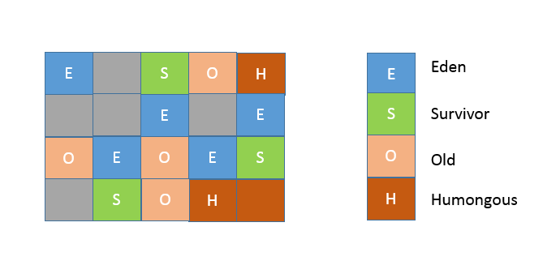

region 的大小是一致的，数值是在 1M 到 32M 字节之间的一个 2 的幂值数，JVM 会尽量划分 2048 个左右、同等大小的 region，这点可以从源码heapRegionBounds.hpp中看到。当然这个数字既可以手动调整，G1 也会根据堆大小自动进行调整。

在 G1 实现中，年代是个逻辑概念，具体体现在，一部分 region 是作为 Eden，一部分作为 Survivor，除了意料之中的 Old region，G1 会将超过 region 50% 大小的对象（在应用中，通常是 byte 或 char 数组）归类为 Humongous 对象，并放置在相应的 region 中。逻辑上，Humongous region 算是老年代的一部分，因为复制这样的大对象是很昂贵的操作，并不适合新生代 GC 的复制算法。

region 的设计副作用是region 大小和大对象很难保证一致，这会导致空间的浪费。region 太小不合适，会令你在分配大对象时更难找到连续空间，这是一个长久存在的情况。可以通过参数`-XX:G1HeapRegionSize=<N, 例如 16>M`修改region大小。

从 GC 算法的角度，G1 选择的是复合算法，可以简化理解为：

在新生代，G1 采用的仍然是并行的复制算法，所以同样会发生 Stop-The-World 的暂停。在老年代，大部分情况下都是并发标记，而整理（Compact）则是和新生代 GC 时捎带进行，并且不是整体性的整理，而是增量进行的。


## 二、集合

Java 的集合框架，Collection 接口是所有集合的根，然后扩展开提供了三大类集合，分别是：

* List，也就是我们用的最多的有序集合，它提供了方便的访问、插入、删除等操作。
* Set，Set 是不允许重复元素的，这是和 List 最明显的区别，也就是不存在两个对象 equals 返回 true。用在保证元素唯一性场合。
* Queue/Deque，则是 Java 提供的标准队列结构的实现，除了集合的基本功能，它还支持类似先入先出（FIFO， First-in-First-Out）或者后入先出（LIFO，Last-In-First-Out）等特定行为。这里不包括 BlockingQueue，因为通常是并发编程场合，所以被放置在并发包里。

广义 Java 集合框架中还包含Map，HashMap 使用频率很高。

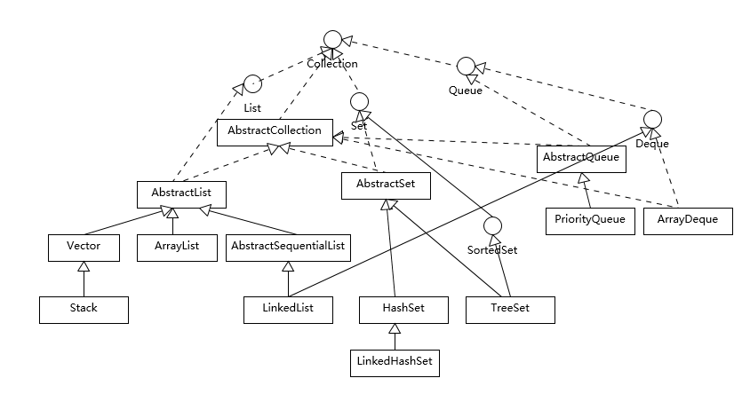

如上图所示每种集合的通用逻辑，都被抽象到相应的抽象类之中，比如 AbstractList 就集中了各种 List 操作的通用部分。这些集合不是完全孤立的，比如，LinkedList 本身，既是 List，也是 Deque 哦。

### 2.1  List

List顶层抽象接口是AbstractList，实现AbstractList接口的有 Vector、ArrayList、LinkedList 

这三者都是实现集合框架中的 List，也就是所谓的有序集合，因此具体功能也比较近似，比如都提供按照位置进行定位、添加或者删除的操作，都提供迭代器以遍历其内容等。但因为具体的设计区别，在行为、性能、线程安全等方面，表现又有很大不同。

* Vector 是 Java 早期提供的**线程安全的动态数组**，如果不需要线程安全，并不建议选择，毕竟同步是有额外开销的。Vector 内部是使用对象数组来保存数据，可以根据需要自动的增加容量，当数组已满时，会创建新的数组，并拷贝原有数组数据，然后插入数据。
* ArrayList 是应用更加广泛的**动态数组**实现，它本身不是线程安全的，所以性能要好很多。与 Vector 近似，ArrayList 也是可以根据需要调整容量，不过两者的调整逻辑有所区别，Vector 在扩容时会提高 1 倍，而 ArrayList 则是增加 50%。
* LinkedList 顾名思义是 Java 提供的**双向链表**，所以它不需要像上面两种那样调整容量，它也不是线程安全的。

Vector 和 ArrayList 作为动态数组，其内部元素以数组形式顺序存储的，所以非常适合随机访问的场合。除了尾部插入和删除元素，往往性能会相对较差，比如我们在中间位置插入一个元素，需要移动后续所有元素。而 LinkedList 进行节点插入、删除却要高效得多，但是随机访问性能则要比动态数组慢。

所以，在应用开发中，如果事先可以估计到，应用操作是偏向于插入、删除，还是随机访问较多，就可以针对性的进行选择。这也是面试最常见的一个考察角度，给定一个场景，选择适合的数据结构。

### 2.2 Set

Set顶层抽象接口是AbstractSet，实现AbstractSet接口的有，TreeSet，HashSet，LinkedHashSet。Set 是不允许重复元素的，这是和 List 最明显的区别，也就是不存在两个对象 equals 返回 true。我们在日常开发中有很多需要保证元素唯一性的场合。TreeSet 代码里实际默认是利用 TreeMap 实现的，Java 类库创建了一个 Dummy 对象“PRESENT”作为 value，然后所有插入的元素其实是以键的形式放入了 TreeMap 里面；同理，HashSet 其实也是以 HashMap 为基础实现的，原来他们只是 Map 类的马甲！

* TreeSet 支持自然顺序访问，但是添加、删除、包含等操作要相对低效（log(n) 时间）。
* HashSet 则是利用哈希算法，理想情况下，如果哈希散列正常，可以提供常数时间的添加、删除、包含等操作，但是它不保证有序。
* LinkedHashSet，内部构建了一个记录插入顺序的双向链表，因此提供了按照插入顺序遍历的能力，与此同时，也保证了常数时间的添加、删除、包含等操作，这些操作性能略低于 HashSet，因为需要维护链表的开销。

在遍历元素时，HashSet 性能受自身容量影响，所以初始化时，除非有必要，不然不要将其背后的 HashMap 容量设置过大。而对于 LinkedHashSet，由于其内部链表提供的方便，遍历性能只和元素多少有关系。

### 2.3 Queue/Deque
Queue/Deque，则是 Java 提供的标准队列结构的实现，除了集合的基本功能，它还支持类似先入先出（FIFO， First-in-First-Out）或者后入先出（LIFO，Last-In-First-Out）等特定行为。这里不包括 BlockingQueue，因为通常是并发编程场合，所以被放置在并发包里。

### 2.4 Map
Map 是广义 Java 集合框架中的另外一部分，Map顶层抽象接口为AbstractMap，实现AbstractMap接口的有，EnumMap、HashMap、TreeMap。Map是以**键值对**的形式存储和操作数据的容器类型。Hashtable例外，它继承了Dictionary类。

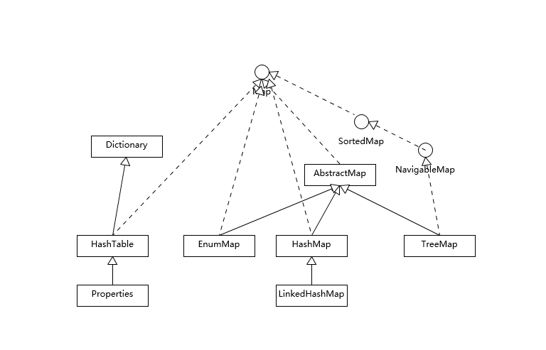

* Hashtable 是早期 Java 类库提供的一个哈希表实现，本身是同步的，不支持 null 键和值，由于同步导致的性能开销，所以已经很少被推荐使用。作为类似 Vector、Stack 的早期集合相关类型，它是扩展了 Dictionary 类的，类结构上与 HashMap 之类明显不同。
* HashMap 是应用更加广泛的哈希表实现，行为上大致上与 HashTable 一致，主要区别在于 HashMap 不是同步的，支持 null 键和值等。通常情况下，HashMap 进行 put 或者 get 操作，可以达到常数时间的性能，所以**它是绝大部分利用键值对存取场景的首选**，比如，实现一个用户 ID 和用户信息对应的运行时存储结构。
* TreeMap 则是基于红黑树的一种提供顺序访问的 Map，和 HashMap 不同，它的 get、put、remove 之类操作都是 O（log(n)）的时间复杂度，具体顺序可以由指定的 Comparator 来决定，或者根据键的自然顺序来判断。

#### 2.4.1 HashMap
HashMap 的性能表现非常依赖于哈希码的有效性，hashCode 和 equals 有以下基本约定：
* equals 相等，hashCode 一定要相等。
* 重写了 hashCode 也要重写 equals。
* hashCode 需要保持一致性，状态改变返回的哈希值仍然要一致。
* equals 的对称、反射、传递等特性。
##### 2.4.1.1 解决冲突的方法
HashMap采用的链表法的方式，链表是单向链表。其他解决hash冲突的方法还有开放地址法，当冲突发生时，使用某种探查技术在散列表中形成一个探查(测)序列。沿此序列逐个单元地查找，直到找到给定的地址。按照形成探查序列的方法不同，可将开放定址法区分为线性探查法、二次探查法、双重散列法等。开放定址法公式为：`H i ( key ) = ( H ( key )+ d i ) mod m ( i = 1,2,…… ， k ( k ≤ m – 1)) `根据di的变化不通可以分为下面三种散列方式：
1. d i ＝ 1 ， 2 ， 3 ， …… 线性探测再散列；
2. d i ＝ 1^2 ，－ 1^2 ， 2^2 ，－ 2^2 ， k^2， -k^2…… 二次探测再散列；
3. d i ＝ 伪随机序列 伪随机再散列； 

##### 2.4.1.2 HashMap结构
``` java
public class HashMap<K,V> extends AbstractMap<K,V> implements Map<K,V>, Cloneable, Serializable {

	static final int DEFAULT_INITIAL_CAPACITY = 1 << 4; // aka 16
	static final int MAXIMUM_CAPACITY = 1 << 30;  // HashMap最大长度，二进制下1向左移动30位，也就是2的30次方
	static final float DEFAULT_LOAD_FACTOR = 0.75f;  // 默认负载因子
	static final int TREEIFY_THRESHOLD = 8;  // 链表树化默认阈值
	static final int UNTREEIFY_THRESHOLD = 6;  // 树还原为连表默认阈值
	
    static class Node<K,V> implements Map.Entry<K,V> {
            final int hash;
            final K key;
            V value;
            Node<K,V> next;

            Node(int hash, K key, V value, Node<K,V> next) {
                this.hash = hash;
                this.key = key;
                this.value = value;
                this.next = next;
            }
    }
    /* ---------------- Fields -------------- */
    transient Node<K,V>[] table;
    int threshold; // 所能容纳的key-value对极限 
    final float loadFactor;  // 负载因子
    /* ---------------- Cloning and serialization -------------- */
    private void writeObject(java.io.ObjectOutputStream s)
		// less ...
    }
    private void readObject(java.io.ObjectInputStream s)
        // less ...
    }
}
```
通过源码我们来一起看看 HashMap 内部的结构，它可以看作是数组（Node<K,V>[] table）和链表结合组成的复合结构，数组被分为一个个桶（bucket），通过哈希值决定了键值对在这个数组的寻址；哈希值相同的键值对，则以单向链表形式存储，最后放入的对象会被放置在连表头节点，是因为HashMap的发明者认为，**后插入的Entry被查找的可能性更大**。这里需要注意的是，如果链表大小超过阈值（TREEIFY_THRESHOLD, 8），链表就会被改造为树形结构，当连表长度小于或者等于阈值（UNTREEIFY_THRESHOLD，6），树形结构就会变成连表结构。那么，为什么 HashMap 要树化呢？本质上这是个安全问题。因为在元素放置过程中，如果一个对象哈希冲突，都被放置到同一个桶里，则会形成一个链表，我们知道链表查询是线性的，会严重影响存取的性能。HashMap默认长度是16，Java 需要它是 2 的幂数值，如果输入是类似 15 这种非幂值，会被自动调整到 16 之类 2 的幂数值。

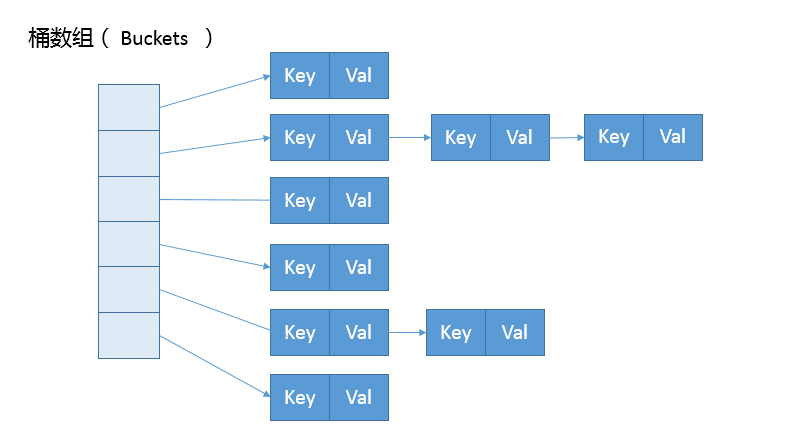

观察HashMap 的源码我们发现存对象的数组`Node<K,V>[] table;`被关键字`transient`修饰，所以当HashMap对象被序列化的时候table字段是没有被序列化的。这有点不符合逻辑，真正存放了数据的数组没有呗序列化？其实在序列化和反序列化的时候，java虚拟机会利用反射的方式调用HashMap中的私有方法`writeObject()`和`readObject()`，来读取和写入`Node<K,V>[] table;`只序列化实际存储元素的数组。引用这种方式序列化是由于不同的虚拟机对于相同 hashCode 产生的 Code 值可能是不一样的，所以反序列化的话的过程也需要在当时的环境中重新计算位置。

##### 2.4.1.2 put(); 方法
HashTable是使用了 lazy-load（懒加载）的方式实现，它的初始化和扩容都是在调用`put()`方法时完成，我们看下源码：
``` java
/* ---------------- Constructor -------------- */
public HashMap(int initialCapacity, float loadFactor){  
    // less ... 
    this.loadFactor = loadFactor;
    this.threshold = tableSizeFor(initialCapacity);
}

/* ---------------- Method -------------- */
public V put(K key, V value) {
    return putVal(hash(key), key, value, false, true);
}

final V putVal(int hash, K key, V value, boolean onlyIfAbent,
               boolean evit) {
    Node<K,V>[] tab; Node<K,V> p; int , i;
    if ((tab = table) == null || (n = tab.length) = 0)
        n = (tab = resize()).length;
    if ((p = tab[i = (n - 1) & hash]) == ull)
        tab[i] = newNode(hash, key, value, nll);
    else {
        // less ...
        if (binCount >= TREEIFY_THRESHOLD - 1) // -1 for first 
           treeifyBin(tab, hash);
        // less ... 
     }
}
```
从`putVal()`方法最初的几行，我们就可以发现几个有意思的地方：
* 如果表格是 null，resize 方法会负责初始化它，这从 tab = resize() 可以看出。
* resize 方法兼顾两个职责，创建初始存储表格，或者在容量不满足需求的时候，进行扩容（resize）。
* 放置新的键值对的过程中，如果长度超过threshold （`threshold = length * Load factor`），就会发生扩容，新的容量是原有容量的2倍，默认的负载因子0.75是对空间和时间效率的一个平衡选择，建议大家不要修改，除非在时间和空间比较特殊的情况下，如果内存空间很多而又对时间效率要求很高，可以降低负载因子Load factor的值；相反，如果内存空间紧张而对时间效率要求不高，可以增加负载因子loadFactor的值，这个值可以大于1。

``` java
/* ---------------- Method 1 -------------- */
static final int hash(Object key) {   //jdk1.8 & jdk1.7
     int h;
     // h = key.hashCode() 为第一步 取hashCode值
     // h ^ (h >>> 16)  为第二步 高位参与运算
     return (key == null) ? 0 : (h = key.hashCode()) ^ (h >>> 16);
}
/* ---------------- Method 2 -------------- */
static int indexFor(int h, int length) {  //jdk1.7的源码，jdk1.8没有这个方法，但是实现原理一样的
     return h & (length-1);  //第三步 取模运算
}
```
这里的Hash算法本质上就是三步：取key的hashCode值、高位参与运算、取模运算。最终得到新放入元素的下标。

在HashMap中，哈希桶数组table的长度length大小必须为2的n次方(一定是合数)，这是一种非常规的设计，主要是为了在取模和扩容时做优化，同时为了减少冲突，HashMap定位哈希桶索引位置时，也加入了高位参与运算的过程。

仔细观察哈希值的源头，我们会发现，它并不是 key 本身的 hashCode，而是来自于 HashMap 内部的另外一个 hash 方法。注意，为什么这里需要将高位数据移位到低位进行异或运算呢？**这是因为有些数据计算出的哈希值差异主要在高位，而 HashMap 里的哈希寻址是忽略容量以上的高位的，那么这种处理就可以有效避免类似情况下的哈希碰撞。**

在JDK1.8的实现中，优化了高位运算的算法，通过`hashCode()`的高16位异或低16位实现的：`(h = k.hashCode()) ^ (h >>> 16)`，主要是从速度、功效、质量来考虑的，这么做可以在当数组table的length比较小的时候，也能保证考虑到高低Bit都参与到Hash的计算中，同时不会有太大的开销。

HashMap的定位做的非常巧妙，它通过h` & (table.length -1)`来得到该对象的保存位，而HashMap底层数组的长度总是2的n次方，这是HashMap在速度上的优化。当length总是2的n次方时，`h & (length-1)`运算等价于对length取模，也就是`h % length`，但是&比%具有更高的效率。


而且当HashMap扩容的时候，我们使用的是2次幂的扩展(指长度扩为原来2倍)，所以，元素的位置要么是在原位置，要么是在原位置再移动2次幂的位置。看下图可以明白这句话的意思，n为table的长度，左侧表示扩容前的key1和key2两种key确定索引位置的示例，右侧表示扩容后key1和key2两种key确定索引位置的示例，其中hash1是key1对应的哈希与高位运算结果。


因此元素在重新计算hash之后，因为n变为2倍，那么n-1的mask范围在高位多1bit(红色)，因此新的index就会发生这样的变化：


因此，我们在扩充HashMap的时候，不需要像JDK1.7的实现那样重新计算hash，只需要看看原来的hash值新增的那个bit是1还是0就好了，是0的话索引没变，是1的话索引变成“原索引+oldCap”，可以看看下图为16扩充为32的resize示意图：

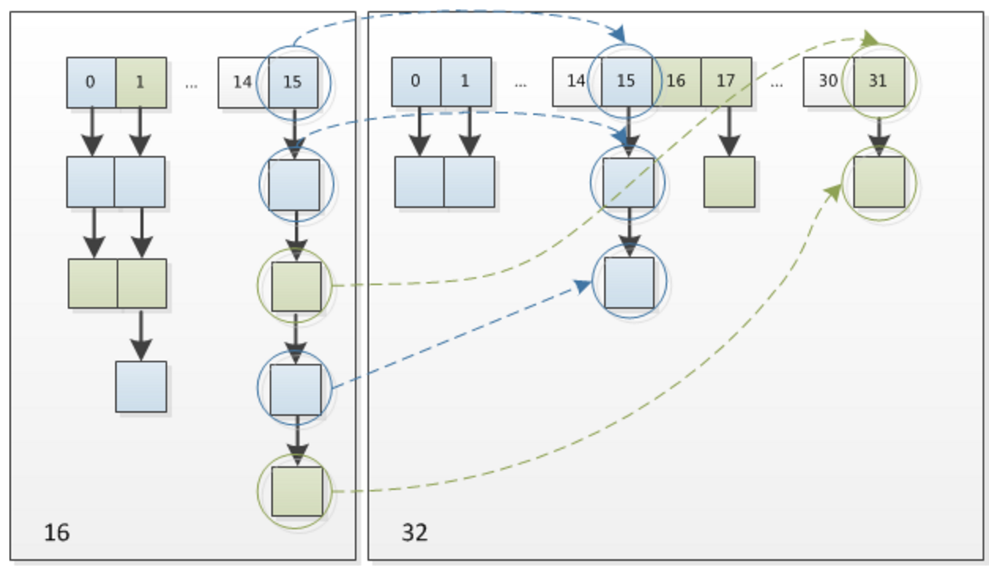

#### 2.4.2 LinkedHashMap
LinkedHashMap 和 TreeMap 都可以保证某种顺序，但二者还是非常不同的，LinkedHashMap 通常提供的是遍历顺序符或插入顺序，它的实现是通过为条目（键值对）维护一个双向链表。
``` java
public class LinkedHashMap<K,V> extends HashMap<K,V> implements Map<K,V>{

	static class Entry<K,V> extends HashMap.Node<K,V> {
        Entry<K,V> before, after;
        Entry(int hash, K key, V value, Node<K,V> next) {
            super(hash, key, value, next);
        }
    }
 }
```
通过源代码我们可以看到LinkedHashMap.Entry是继承了HashMap.Node，增加了 before, after，组成双向连表。LinkedHashMap的有序可以设置成插入顺序或访问顺序，默认是按照插入顺序组成双向链表。通过特定构造函数，将accessOrder设置成true，可以创建反映访问顺序的链表，所谓的 put、get、compute 等，都算作“访问”。

#### 2.4.3 treeMap
LinkedHashMap保证数据可以保持插入顺序，或者访问顺序，而如果我们希望Map可以保持key的大小顺序的时候，我们就需要利用TreeMap了。TreeMap的实现是的红黑树，使用红黑树的好处是能够使得树具有不错的平衡性，这样操作的速度就可以达到log(n)的水平。
红黑树是一种自平衡二叉查找树。它的统计性能要好于平衡二叉树

### 2.5 线程安全的集合

#### 2.5.1 线程安全包装

Vector、Hashtable 、等是线程安全的集合，除此之外我们完全可以利用类似方法来实现基本的线程安全集合：
``` java
static <T> List<T> synchronizedList(List<T> list)
List list = Collections.synchronizedList(new ArrayList());
```
它的实现，基本就是将每个基本方法，比如 get、set、add 之类，都通过 synchronizd 添加基本的**同步**支持，非常简单粗暴，但也非常实用。注意这些方法创建的线程安全集合，都符合迭代时 fail-fast[1]行为，当发生意外的并发修改时，尽早抛出 `ConcurrentModificationException` 异常，以避免不可预计的行为。
#### 2.5.2 java.util.concurrent
java.util.concurrent 包含许多线程安全、高性能的并发构建块。不客气地说，创建 java.util.concurrent 的目的就是要实现 Collection 框架对数据结构所执行的并发操作。通过提供一组可靠的、高性能并发构建块，开发人员可以提高并发类的线程安全、可伸缩性、性能、可读性和可靠性。
java.util.concurrent 及其子包，集中了 Java 并发的各种基础工具类，具体主要包括几个方面：
* 提供了比 synchronized 更加高级的各种同步结构，包括 CountDownLatch、CyclicBarrier、Semaphore 等，可以实现更加丰富的多线程操作，比如利用 Semaphore 作为资源控制器，限制同时进行工作的线程数量。
* 各种线程安全的容器，比如最常见的 ConcurrentHashMap、有序的 ConcunrrentSkipListMap，或者通过类似快照机制，实现线程安全的动态数组 CopyOnWriteArrayList 等。
* 各种并发队列实现，如各种 BlockedQueue 实现，比较典型的 ArrayBlockingQueue、 SynchorousQueue 或针对特定场景的 PriorityBlockingQueue 等。
* 强大的 Executor 框架，可以创建各种不同类型的线程池，调度任务运行等，绝大部分情况下，不再需要自己从头实现线程池和任务调度器。

java.util.concurrent 包提供的容器（Queue、List、Set）、Map，从命名上可以大概区分为 ConcurrentXX、CopyOnWriteXX和 BlockingXX等三类，同样是线程安全容器，可以简单认为：

Concurrent 类型没有类似 CopyOnWrite 之类容器相对较重的修改开销。但是，凡事都是有代价的，Concurrent 往往提供了较低的遍历一致性。你可以这样理解所谓的弱一致性，例如，当利用迭代器遍历时，如果容器发生修改，迭代器仍然可以继续进行遍历。与弱一致性对应的，就是我介绍过的同步容器常见的行为“fail-fast”，也就是检测到容器在遍历过程中发生了修改，则抛出 ConcurrentModificationException，不再继续遍历。弱一致性的另外一个体现是，size 等操作准确性是有限的，未必是 100% 准确。与此同时，读取的性能具有一定的不确定性。

并发包里提供的线程安全 Map、List 和 Set。请参考下面的类图。

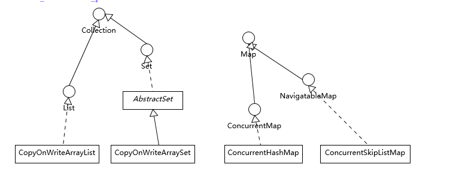

你可以看到，总体上种类和结构还是比较简单的，如果我们的应用侧重于 Map 放入或者获取的速度，而不在乎顺序，大多推荐使用 ConcurrentHashMap，反之则使用 ConcurrentSkipListMap；如果我们需要对大量数据进行非常频繁地修改，ConcurrentSkipListMap 也可能表现出优势。
我在前面的专栏，谈到了普通无顺序场景选择 HashMap，有顺序场景则可以选择类似 TreeMap 等，但是为什么并发容器里面没有 ConcurrentTreeMap 呢？

这是因为 TreeMap 要实现高效的线程安全是非常困难的，它的实现基于复杂的红黑树。为保证访问效率，当我们插入或删除节点时，会移动节点进行平衡操作，这导致在并发场景中难以进行合理粒度的同步。而 SkipList 结构则要相对简单很多，通过层次结构提高访问速度，虽然不够紧凑，空间使用有一定提高（O(nlogn)），但是在增删元素时线程安全的开销要好很多。

下面这张图是 Java 并发类库提供的各种各样的线程安全队列实现

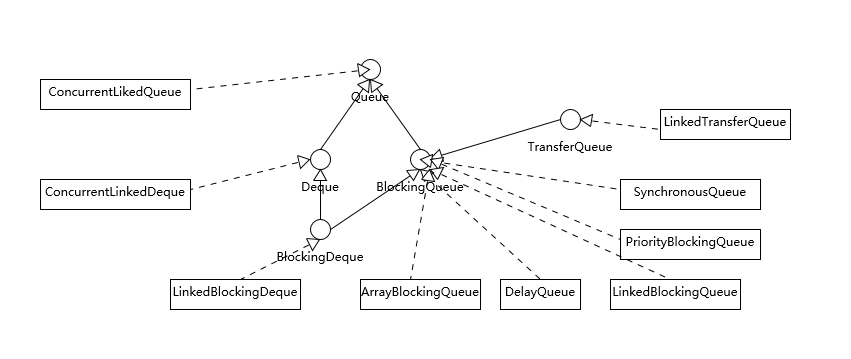

##### 2.5.2.1 Semaphore（信号量）
Java 提供了经典信号量Semaphore的实现，它通过控制一定数量的允许（permit）的方式，来达到限制通用资源访问的目的。你可以想象一下这个场景，在车站、机场等出租车时，当很多空出租车就位时，为防止过度拥挤，调度员指挥排队等待坐车的队伍一次进来 5 个人上车，等这 5 个人坐车出发，再放进去下一批，这和 Semaphore 的工作原理有些类似。如果初始化了一个许可为1的Semaphore，那么就相当于一个不可重入的互斥锁（Mutex）。
实例场景：理论的听起来有些绕口，其实假设生活中一个常见的场景：每天早上，大家都热衷于带薪上厕所，但是公司厕所一共只有10个坑位。。那么只能同时10个人用着，后面来的人都得等着（阻塞），如果走了2个人，那么又可以进去2个人。这里面就是Semaphore的应用场景，争夺有限的资源。

``` java
import java.util.concurrent.Semaphore;
public class AbnormalSemaphoreSample {
	public static void main(String[] args) throws InterruptedException {
    	Semaphore semaphore = new Semaphore(0);
    	for (int i = 0; i < 10; i++) {
        	Thread t = new Thread(new MyWorker(semaphore));
        	t.start();
    	}
    	System.out.println("Action...GO!");
    	semaphore.release(5);
    	System.out.println("Wait for permits off");
    	while (semaphore.availablePermits()!=0) {
        	Thread.sleep(100L);
    	}
    	System.out.println("Action...GO again!");
    	semaphore.release(5);
	}
}
class MyWorker implements Runnable {
	private Semaphore semaphore;
	public MyWorker(Semaphore semaphore) {
    	this.semaphore = semaphore;
	}
	@Override
	public void run() {
    	try {
        	semaphore.acquire();
        	System.out.println("Executed!");
    	} catch (InterruptedException e) {
        	e.printStackTrace();
    	}
	}
}
```

##### 2.5.2.2 CountDownLatch（闭锁）
CountDownLatch许一个或多个线程等待某些操作完成。CountDownLatch 是不可以重置的，所以无法重用；而 CyclicBarrier 则没有这种限制，可以重用。CountDownLatch 的基本操作组合是 countDown/await。调用 await 的线程阻塞等待 countDown 足够的次数，不管你是在一个线程还是多个线程里 countDown，只要次数足够即可。所以就像 Brain Goetz 说过的，CountDownLatch 操作的是事件。
CountDownLatch是一种灵活的闭锁实现，它可以使一个或者多个线程等待一组事件的发生。闭锁状态包含一个计数器，该计数器被初始化为一个正数，表示需要等待的事件数量。countDown方法递减计数器，表示已经有一个事件已经发生了。而await方法等待计数器达到0，这表示所有需要等待的事件都已经发生。如果计数器的值非0，那么await会一直阻塞直到计数器为0，或者等待中的线程中断或者超时。代码如下

``` java
import java.util.concurrent.CountDownLatch;
public class LatchSample {
	public static void main(String[] args) throws InterruptedException {
    	CountDownLatch latch = new CountDownLatch(6);
           for (int i = 0; i < 5; i++) {
                Thread t = new Thread(new FirstBatchWorker(latch));
                t.start();
    	}
    	for (int i = 0; i < 5; i++) {
        	    Thread t = new Thread(new SecondBatchWorker(latch));
        	    t.start();
    	}
           // 注意这里也是演示目的的逻辑，并不是推荐的协调方式
    	while ( latch.getCount() != 1 ){
        	    Thread.sleep(100L);
    	}
    	System.out.println("Wait for first batch finish");
    	latch.countDown();
	}
}
class FirstBatchWorker implements Runnable {
	private CountDownLatch latch;
	public FirstBatchWorker(CountDownLatch latch) {
    	this.latch = latch;
	}
	@Override
	public void run() {
        	System.out.println("First batch executed!");
        	latch.countDown();
	}
}
class SecondBatchWorker implements Runnable {
	private CountDownLatch latch;
	public SecondBatchWorker(CountDownLatch latch) {
    	this.latch = latch;
	}
	@Override
	public void run() {
    	try {
        	latch.await();
        	System.out.println("Second batch executed!");
    	} catch (InterruptedException e) {
        	e.printStackTrace();
    	}
	}
}
```
##### 2.5.2.3 CyclicBarrier（栅栏）
CyclicBarrier适用于这样的情况：你希望创建一组任务，它们并行地执行工作，然后在下一个步骤之前等待，直到所有任务都完成。栅栏和闭锁的关键区别在于，所有线程必须同时到达栅栏位置，才能继续执行。
闭锁用于等待事件，而栅栏是线程之间彼此等待，等到都到的时候再决定做下一件事。可以参考Java并发工具类（闭锁CountDownLatch）
拿运动员的事情举例，运动员们跑到终点，互相等待所有人都到达终点后，再一起去做喝酒这件事。（运动员也许不能喝酒的，也许大家再跑一轮。）

``` java
import java.util.concurrent.BrokenBarrierException;
import java.util.concurrent.CyclicBarrier;
public class CyclicBarrierSample {
	public static void main(String[] args) throws InterruptedException {
    	CyclicBarrier barrier = new CyclicBarrier(5, new Runnable() {
        	@Override
        	public void run() {
            	System.out.println("Action...GO again!");
        	}
    	});
    	for (int i = 0; i < 5; i++) {
        	Thread t = new Thread(new CyclicWorker(barrier));
        	t.start();
    	}
	}
	static class CyclicWorker implements Runnable {
    	private CyclicBarrier barrier;
    	public CyclicWorker(CyclicBarrier barrier) {
        	this.barrier = barrier;
    	}
    	@Override
    	public void run() {
        	try {
            	for (int i=0; i<3 ; i++){
                	System.out.println("Executed!");
                	barrier.await();
            	}
        	} catch (BrokenBarrierException e) {
            	e.printStackTrace();
        	} catch (InterruptedException e) {
            	e.printStackTrace();
        	}
 	   }
	}
}
```

##### 2.5.2.4 ConcurrentHashMap
ConcurrentHashMap 的设计实现其实一直在演化，早期 ConcurrentHashMap，其实现是基于分离锁，也就是将内部进行分段（Segment），里面则是 HashEntry 的数组，和 HashMap 类似，哈希相同的条目也是以链表形式存放。HashEntry 内部使用 volatile 的 value 字段来保证可见性，也利用了不可变对象的机制以改进利用 Unsafe [2]提供的底层能力，比如 volatile access，去直接完成部分操作，以最优化性能，毕竟 Unsafe 中的很多操作都是 JVM intrinsic 优化过的。其核心是利用分段设计，在进行并发操作的时候，只需要锁定相应段，这样就有效避免了类似 Hashtable 整体同步的问题，大大提高了性能。在构造的时候，Segment 的数量由所谓的 concurrentcyLevel 决定，默认是 16，也可以在相应构造函数直接指定。注意，Java 需要它是 2 的幂数值，如果输入是类似 15 这种非幂值，会被自动调整到 16 之类 2 的幂数值。

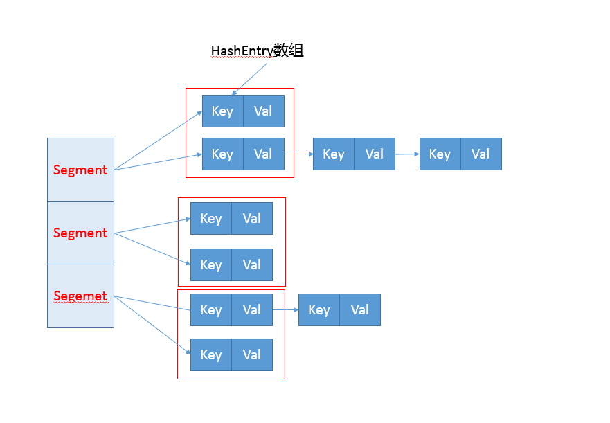

在进行并发写操作时ConcurrentHashMap 会获取再入锁，以保证数据一致性，Segment 本身就是基于 ReentrantLock 的扩展实现，所以，在并发修改期间，相应 Segment 是被锁定的。在最初阶段，进行重复性的扫描，以确定相应 key 值是否已经在数组里面，进而决定是更新还是放置操作，重复扫描、检测冲突是 ConcurrentHashMap 的常见技巧。ConcurrentHashMap 在扩容时它进行的不是整体的扩容，而是单独对 Segment 进行扩容

在 Java 8 和之后的版本中ConcurrentHashMap总体结构上，它的内部存储变得和HashMap 结构非常相似，同样是大的桶（bucket）数组，然后内部也是一个个所谓的链表结构（bin），同步的粒度要更细致一些。其内部仍然有 Segment 定义，但仅仅是为了保证序列化时的兼容性而已，不再有任何结构上的用处。因为不再使用 Segment，初始化操作大大简化，修改为 lazy-load 形式，这样可以有效避免初始开销，解决了老版本很多人抱怨的这一点。数据存储利用 volatile 来保证可见性。使用 CAS 等操作，在特定场景进行无锁并发操作。使用 Unsafe、LongAdder 之类底层手段，进行极端情况的优化。

##### 2.5.2.4 ConcurrentSkipListMap
什么是SkipList？Skip List ，称之为跳表，它是一种可以替代平衡树的数据结构，其数据元素默认按照key值升序，天然有序。Skip list让已排序的数据分布在多层链表中，以0-1随机数决定一个数据的向上攀升与否，通过“空间来换取时间”的一个算法，在每个节点中增加了向前的指针，在插入、删除、查找时可以忽略一些不可能涉及到的结点，从而提高了效率。

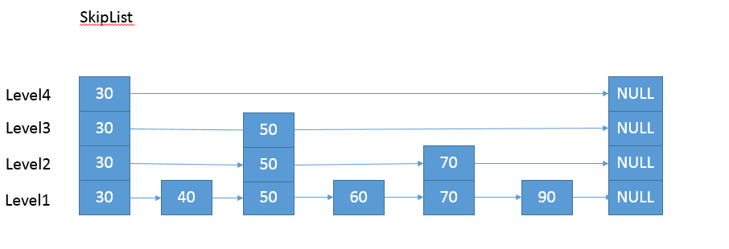

SkipList具备如下特性：
1. 由很多层结构组成，level是通过一定的概率随机产生的
2. 每一层都是一个有序的链表，默认是升序，也可以根据创建映射时所提供的Comparator进行排序，具体取决于使用的构造方法
3. 最底层(Level 1)的链表包含所有元素
4. 如果一个元素出现在Level i 的链表中，则它在Level i 之下的链表也都会出现
5. 每个节点包含两个指针，一个指向同一链表中的下一个元素，一个指向下面一层的元素

SkipList的插入操作主要包括：查找合适的位置。这里需要明确一点就是在确认新节点要占据的层次K时，采用丢硬币的方式，完全随机。如果占据的层次K大于链表的层次，则重新申请新的层，否则插入指定层次，然后申请新的节点，调整指针。

##### 2.5.2.5 CopyOnWriteArrayList、CopyOnWriteArraySet
关于两个 CopyOnWrite 容器，其实 CopyOnWriteArraySet 是通过包装了 CopyOnWriteArrayList 来实现的。

CopyOnWrite 的原理是，任何修改操作，如 add、set、remove，我们不在原有内存块中进行写操作，而是将内存拷贝一份，在新的内存中进行写操作，写完之后呢，就将指向原来内存指针指向新的内存，原来的内存就可以被回收掉嘛。所以这种数据结构，相对比较适合读多写少的操作，不然修改的开销还是非常明显的。这些修改操作的逻辑部分用了ReentrantLock加锁，避免拷贝出多份造成线程安全问题。

##### 2.5.2.6 Deque
从基本的数据结构的角度分析Deque，有两个特别的Deque实现，ConcurrentLinkedDeque 和 LinkedBlockingDeque。Deque 的侧重点是支持对队列头尾都进行插入和删除，所以提供了特定的方法，尾部插入时需要的addLast(e)、offerLast(e)。尾部删除所需要的removeLast()、pollLast()。从上面这些角度，能够理解 ConcurrentLinkedDeque 和 LinkedBlockingQueue 的主要功能区别，也就足够日常开发的需要了。

##### 2.5.2.7 Queue
从行为特征来看，绝大部分 Queue 都是实现了 BlockingQueue 接口。在常规队列操作基础上，Blocking 意味着其提供了特定的等待性操作，获取时（take）等待元素进队，或者插入时（put）等待队列出现空位。

* ArrayBlockingQueue 是最典型的的有界队列，其内部以 final 的数组保存数据，数组的大小就决定了队列的边界，所以我们在创建 ArrayBlockingQueue 时，都要指定容量，如`public ArrayBlockingQueue(int capacity, boolean fair)`
* LinkedBlockingQueue，容易被误解为无边界，但其实其行为和内部代码都是基于有界的逻辑实现的，只不过如果我们没有在创建队列时就指定容量，那么其容量限制就自动被设置为 Integer.MAX_VALUE，成为了无界队列。
* SynchronousQueue，这是一个非常奇葩的队列实现，每个删除操作都要等待插入操作，反之每个插入操作也都要等待删除动作。那么这个队列的容量是多少呢？是 1 吗？其实不是的，其内部容量是 0。
* PriorityBlockingQueue 是无边界的优先队列，虽然严格意义上来讲，其大小总归是要受系统资源影响。
* DelayedQueue 和 LinkedTransferQueue 同样是无边界的队列。对于无边界的队列，有一个自然的结果，就是 put 操作永远也不会发生其他 BlockingQueue 的那种等待情况。
如果我们分析不同队列的底层实现，BlockingQueue 基本都是基于ReentrantLock锁实现， LinkedBlockingQueue源码如下：
``` java
/** Lock held by take, poll, etc */
private final ReentrantLock takeLock = new ReentrantLock();
/** Wait queue for waiting takes */
private final Condition notEmpty = takeLock.newCondition();
/** Lock held by put, offer, etc */
private final ReentrantLock putLock = new ReentrantLock();
/** Wait queue for waiting puts */
private final Condition notFull = putLock.newCondition();
// ConcurrentLinkedQueue 等，则是基于 CAS 的无锁技术，不需要在每个操作时使用锁，所以扩展性表现要更加优异。
public E take() throws InterruptedException {
    final E x;
    final int c;
    final AtomicInteger count = this.count;
    final ReentrantLock takeLock = this.takeLock;
    takeLock.lockInterruptibly();
    try {
        while (count.get() == 0) {
            notEmpty.await();
        }
        x = dequeue();
        c = count.getAndDecrement();
        if (c > 1)
            notEmpty.signal();
    } finally {
        takeLock.unlock();
    }
    if (c == capacity)
        signalNotFull();
    return x;
}
```

ArrayBlockingQueue与LinkedBlockingQueue 锁的实现是有区别的。ArrayBlockingQueue中notEmpty、notFull 都是同一个再入锁的条件变量，而 LinkedBlockingQueue 则改进了锁操作的粒度，头、尾操作使用不同的锁，所以在通用场景下，它的吞吐量相对要更好一些。下面是ArrayBlockingQueue源码：
``` java
// notEmpty、notFull 为同一ReentrantLock的condition（条件）
/** Condition for waiting takes */
private final Condition notEmpty;
/** Condition for waiting puts */
private final Condition notFull;
 
public ArrayBlockingQueue(int capacity, boolean fair) {
	if (capacity <= 0)
    	throw new IllegalArgumentException();
	this.items = new Object[capacity];
	lock = new ReentrantLock(fair);
	notEmpty = lock.newCondition();
	notFull =  lock.newCondition();
}
// 当队列为空时，试图 take 的线程的正确行为应该是等待入队发生，而不是直接返回，使用条件notEmpty就可以优雅地实现这一逻辑。
public E take() throws InterruptedException {
	final ReentrantLock lock = this.lock;
	lock.lockInterruptibly();
	try {
    	while (count == 0)
        	notEmpty.await();
    	return dequeue();
	} finally {
    	lock.unlock();
	}
}
// 通过 signal/await 的组合，完成了条件判断和通知等待线程，非常顺畅就完成了状态流转。注意，signal 和 await 成对调用非常重要。
private void enqueue(E e) {
	// assert lock.isHeldByCurrentThread();
	// assert lock.getHoldCount() == 1;
	// assert items[putIndex] == null;
	final Object[] items = this.items;
	items[putIndex] = e;
	if (++putIndex == items.length) putIndex = 0;
	count++;
	notEmpty.signal(); // 通知等待的线程，非空条件已经满足
}
```

在实际开发中，我提到过 Queue 被广泛使用在生产者 - 消费者场景，比如利用 BlockingQueue 来实现，由于其提供的等待机制，我们可以少操心很多协调工作。如果使用非 Blocking 的队列，那么我们就要自己去实现轮询、条件判断（如检查 poll 返回值是否 null）等逻辑，如果没有特别的场景要求，Blocking 实现起来代码更加简单、直观。

日常的应用开发中，如何进行选择:
* 考虑应用场景中对队列边界的要求。ArrayBlockingQueue 是有明确的容量限制的，而 LinkedBlockingQueue 则取决于我们是否在创建时指定，SynchronousQueue 则干脆不能缓存任何元素。
* 从空间利用角度，数组结构的 ArrayBlockingQueue 要比 LinkedBlockingQueue 紧凑，因为其不需要创建所谓节点，但是其初始分配阶段就需要一段连续的空间，所以初始内存需求更大。
* 通用场景中，LinkedBlockingQueue 的吞吐量一般优于 ArrayBlockingQueue，因为它实现了更加细粒度的锁操作。
* ArrayBlockingQueue 实现比较简单，性能更好预测，属于表现稳定的“选手”。
* 如果我们需要实现的是两个线程之间接力性（handoff）的场景，你可能会选择 CountDownLatch，但是SynchronousQueue也是完美符合这种场景的，而且线程间协调和数据传输统一起来，代码更加规范。
* 可能令人意外的是，很多时候 SynchronousQueue 的性能表现，往往大大超过其他实现，尤其是在队列元素较小的场景。

### 2.6 集合排序
* 对于原始数据类型，目前使用的是所谓双轴快速排序（Dual-Pivot QuickSort），是一种改进的快速排序算法，早期版本是相对传统的快速排序，该算法是不稳定的。
* 而对于对象数据类型，目前则是使用TimSort，思想上也是一种归并和二分插入排序（binarySort）结合的优化排序算法。TimSort 并不是 Java 的独创，简单说它的思路是查找数据集中已经排好序的分区（这里叫 run），然后合并这些分区来达到排序的目的。

Java 8 引入了并行排序算法parallelSort，这是为了充分利用现代多核处理器的计算能力，底层实现基于 fork-join 框架，处理的数据集比较小的时候，差距不明显，甚至还表现差一点；但是，当数据集增长到数万或百万以上时，提高就非常大了，具体还是取决于处理器和系统环境。只有当数组长度大于 `MIN_ARRAY_SORT_GRAN` 时才进行多线程并行排序 (源码中 MIN_ARRAY_SORT_GRAN 为 1<<13，即 8192)，简单的说实现方法就是将数组拆分成多个子数组，多线程进行排序，然后归并

### 2.7 集合新特性

#### 2.7.1 Lambda 和 Stream
在 Java 8 之中，Java 平台支持了 Lambda 和 Stream（在程序界称之为流），相应的 Java 集合框架也进行了大范围的增强，以支持类似为集合创建相应 stream或者 parallelStream 的方法实现，我们可以非常方便的实现函数式代码。
阅读 Java 源代码，你会发现，这些 API 的设计和实现比较独特，它们并不是实现在抽象类里面，而是以默认方法的形式实现在 Collection 这样的接口里！（方法被default关键字修饰）这是 Java 8 在语言层面的新特性，允许接口实现默认方法，理论上来说，我们原来实现在类似 Collections 这种工具类中的方法，大多可以转换到相应的接口上。

流在处理数据进行一些迭代操作的时候确认很方便，但是在执行一些耗时或是占用资源很高的任务时候，串行化的流无法带来速度/性能上的提升，并不能满足我们的需要，通常我们会使用多线程来并行或是分片分解执行任务，而在Stream中也提供了这样的并行方法，那就是使用parallelStream()方法或者是使用stream().parallel()来转化为并行流，而并行流是使用了Fork/Join 框架


#### 2.7.2 List.of()、Set.of()
在 Java 9 中，Java 标准类库提供了一系列的静态工厂方法，比如，List.of()、Set.of()，大大简化了构建小的容器实例的代码量。根据业界实践经验，我们发现相当一部分集合实例都是容量非常有限的，而且在生命周期中并不会进行修改。利用新的容器静态工厂方法，一句代码就够了，并且保证了不可变性。

``` java
List<String> simpleList = List.of("Hello","world");
```
更进一步，通过各种 of 静态工厂方法创建的实例，还应用了一些我们所谓的最佳实践，比如，它是不可变的，符合我们对线程安全的需求；它因为不需要考虑扩容，所以空间上更加紧凑等。

## 三、 多线程
线程有时称为 轻量级进程，是系统调度的最小单元，一个进程可以包含多个线程。与进程一样，它们拥有通过程序运行的独立的并发路径，并且每个线程都有自己的程序计数器，称为堆栈和本地变量。然而，线程存在于进程中，它们与同一进程内的其他线程共享内存、文件句柄以及每进程状态。因为一个进程中的线程是在同一个地址空间中执行的，所以多个线程可以同时访问相同对象，并且它们从同一堆栈中分配对象。虽然这使线程更易于与其他线程共享信息，但也意味着您必须确保线程之间不相互干涉。正确使用线程时，线程能带来诸多好处，其中包括更好的资源利用、简化开发、高吞吐量、更易响应的用户界面以及能执行异步处理。

在具体实现中，线程还分为内核线程、用户线程，Java 的线程实现其实是与虚拟机相关的。对于我们最熟悉的 Sun/Oracle JDK，其线程也经历了一个演进过程，基本上在 Java 1.2 之后，JDK 已经抛弃了所谓的Green Thread，也就是用户调度的线程，现在的模型是一对一映射到操作系统内核线程。如果我们来看 Thread 的源码，你会发现其基本操作逻辑大都是以 JNI 形式调用的本地代码。

使用线程的理由包括：
• **更易响应的用户界面**。 事件驱动的 GUI 工具包（如 AWT 或 Swing）使用单独的事件线程来处理 GUI 事件。从事件线程中调用通过 GUI 对象注册的事件监听器。然而，如果事件监听器将执行冗长的任务（如文档拼写检查），那么 UI 将出现冻结，因为事件线程直到冗长任务完毕之后才能处理其他事件。通过在单独线程中执行冗长操作，当执行冗长后台任务时，UI 能继续响应。
• **使用多处理器**。 多处理器（MP）系统变得越来越便宜，并且分布越来越广泛。因为调度的基本单位通常是线程，所以不管有多少处理器可用，一个线程的应用程序一次只能在一个处理器上运行。在设计良好的程序中，通过更好地利用可用的计算机资源，多线程能够提高吞吐量和性能。
• **简化建模**。 有效使用线程能够使程序编写变得更简单，并易于维护。通过合理使用线程，个别类可以避免一些调度的详细、交叉存取操作、异步 IO 和资源等待以及其他复杂问题。相反，它们能专注于域的要求，简化开发并改进可靠性。    
• **异步或后台处理**。 服务器应用程序可以同时服务于许多远程客户机。如果应用程序从 socket 中读取数据，并且没有数据可以读取，那么对 read() 的调用将被阻塞，直到有数据可读。在单线程应用程序中，这意味着当某一个线程被阻塞时，不仅处理相应请求要延迟，而且处理所有请求也将延迟。然而，如果每个 socket 都有自己的 IO 线程，那么当一个线程被阻塞时，对其他并发请求行为没有影响。

大多数现代处理器对并发对某一硬件级别提供支持，通常以 compare-and-swap （CAS）指令形式。CAS 是一种低级别的、细粒度的技术，它允许多个线程更新一个内存位置，同时能够检测其他线程的冲突并进行恢复。它是许多高性能并发算法的基础。

### 3.1 多线程演进
* 1.0-1.4 中的 java.lang.Thread
* 5.0 中的 java.util.concurrent
* 6.0 中的 Phasers 等
* 7.0 中的 Fork/Join 框架
* 8.0 中的 Lambda

### 3.2 IO
Java IO 方式有很多种，基于不同的 IO 抽象模型和交互方式，可以进行简单区分，IO 不仅仅是对文件的操作，网络编程中，比如 Socket 通信，都是典型的 IO 操作目标。
* 区分同步或异步（synchronous/asynchronous）。简单来说，同步是一种可靠的有序运行机制，当我们进行同步操作时，后续的任务是等待当前调用返回，才会进行下一步；而异步则相反，其他任务不需要等待当前调用返回，通常依靠事件、回调等机制来实现任务间次序关系。
* 区分阻塞与非阻塞（blocking/non-blocking）。在进行阻塞操作时，当前线程会处于阻塞状态，无法从事其他任务，只有当条件就绪才能继续，比如 ServerSocket 新连接建立完毕，或数据读取、写入操作完成；而非阻塞则是不管 IO 操作是否结束，直接返回，相应操作在后台继续处理。
不能一概而论认为同步或阻塞就是低效，具体还要看应用和系统特征。

输入流、输出流（InputStream/OutputStream）是用于读取或写入字节的，例如操作图片文件。而 Reader/Writer 则是用于操作字符，增加了字符编解码等功能，适用于类似从文件中读取或者写入文本信息。本质上计算机操作的都是字节，不管是网络通信还是文件读取，Reader/Writer 相当于构建了应用逻辑和原始数据之间的桥梁。
BufferedOutputStream 等带缓冲区的实现，可以避免频繁的磁盘读写，进而提高 IO 处理效率。这种设计利用了缓冲区，将批量数据进行一次操作，但在使用中千万别忘了 flush。
很多 IO 工具类都实现了 Closeable 接口，因为需要进行资源的释放。比如，打开 FileInputStream，它就会获取相应的文件描述符（FileDescriptor），需要利用 try-with-resources、 try-finally 等机制保证 FileInputStream 被明确关闭，进而相应文件描述符也会失效，否则将导致资源无法被释放。

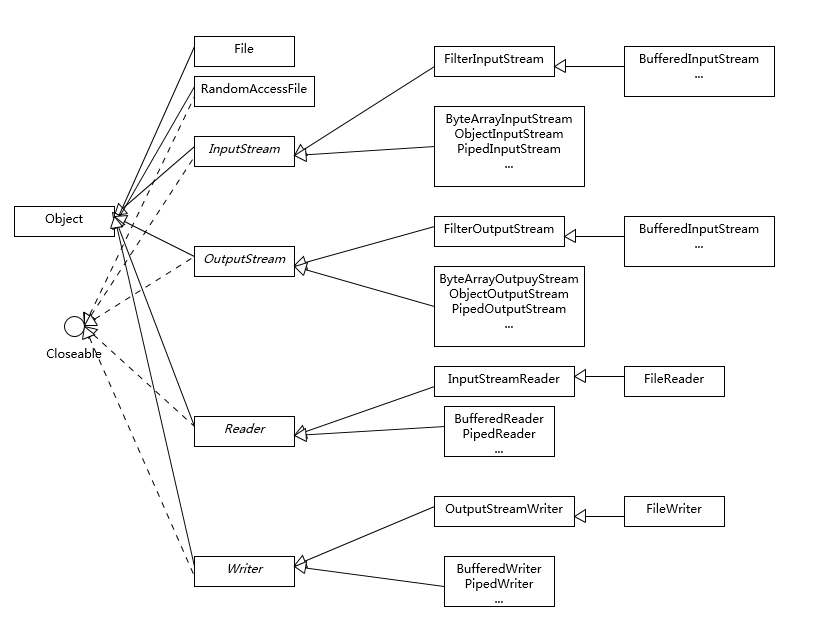

#### 3.2.1 阻塞类BIO
java.io 包，它基于流模型实现，提供了我们最熟知的一些 IO 功能，比如 File 抽象、输入输出流等。交互方式是同步、阻塞的方式。
java.net 下面提供的部分网络 API，比如 Socket、ServerSocket、HttpURLConnection 通常也归类到同步阻塞 IO 类库，因为网络通信同样是 IO 行为。

#### 3.2.2 异步NIO、NIO2、AIO
Java 1.4 中引入了 NIO 框架（java.nio 包），提供了 Channel、Selector、Buffer 等新的抽象，可以构建多路复用的、同步非阻塞 IO 程序，提供了更接近操作系统底层的高性能数据操作方式。
Java 7 中，NIO 有了进一步的改进，也就是 NIO 2，引入了异步非阻塞 IO 方式，也有很多人叫它 AIO（Asynchronous IO）。异步 IO 操作基于事件和回调机制，可以简单理解为，应用操作直接返回，而不会阻塞在那里，当后台处理完成，操作系统会通知相应线程进行后续工作。

##### 3.2.2.1  NIO 的主要组成部分
* Buffer，高效的数据容器，除了布尔类型，所有原始数据类型都有相应的 Buffer 实现。
* Channel，类似在 Linux 之类操作系统上看到的文件描述符，是 NIO 中被用来支持批量式 IO 操作的一种抽象。
* File 或者 Socket，通常被认为是比较高层次的抽象，而 Channel 则是更加操作系统底层的一种抽象，这也使得 NIO 得以充分利用现代操作系统底层机制，获得特定场景的性能优化，例如，DMA（Direct Memory Access）等。不同层次的抽象是相互关联的，我们可以通过 Socket 获取 Channel，反之亦然。
* Selector，是 NIO 实现多路复用的基础，它提供了一种高效的机制，可以检测到注册在 Selector 上的多个 Channel 中，是否有 Channel 处于就绪状态，进而实现了单线程对多 Channel 的高效管理。

Java 语言目前的线程实现是比较重量级的，启动或者销毁一个线程是有明显开销的，每个线程都有单独的线程栈等结构，需要占用非常明显的内存，所以，为每一个 Client 请求启动一个线程似乎都有些浪费。我们引入线程池机制来避免浪费。如果连接数并不是非常多，只有最多几百个连接的普通应用，这种模式往往可以工作的很好。但是，如果连接数量急剧上升，这种实现方式就无法很好地工作了，因为线程上下文切换开销会在高并发时变得很明显，这是同步阻塞方式的低扩展性劣势。

NIO 引入的多路复用机制，提供了另外一种思路，请参考我下面提供的新的版本。
* 首先，通过 Selector.open() 创建一个 Selector，作为类似调度员的角色。
* 然后，创建一个 ServerSocketChannel，并且向 Selector 注册，通过指定 SelectionKey.OP_ACCEPT，告诉调度员，它关注的是新的连接请求。注意，为什么我们要明确配置非阻塞模式呢？这是因为阻塞模式下，注册操作是不允许的，会抛出 IllegalBlockingModeException 异常。
* Selector 阻塞在 select 操作，当有 Channel 发生接入请求，就会被唤醒。
* 在 sayHelloWorld 方法中，通过 SocketChannel 和 Buffer 进行数据操作，在本例中是发送了一段字符串。

``` java
public class NIOServer extends Thread {
    public void run() {
        try (Selector selector = Selector.open();
             ServerSocketChannel serverSocket = ServerSocketChannel.open();) {// 创建 Selector 和 Channel
            serverSocket.bind(new InetSocketAddress(InetAddress.getLocalHost(), 8888));
            serverSocket.configureBlocking(false);
            // 注册到 Selector，并说明关注点
            serverSocket.register(selector, SelectionKey.OP_ACCEPT);
            while (true) {
                selector.select();// 阻塞等待就绪的 Channel，这是关键点之一
                Set<SelectionKey> selectedKeys = selector.selectedKeys();
                Iterator<SelectionKey> iter = selectedKeys.iterator();
                while (iter.hasNext()) {
                    SelectionKey key = iter.next();
                   // 生产系统中一般会额外进行就绪状态检查
                    sayHelloWorld((ServerSocketChannel) key.channel());
                    iter.remove();
                }
            }
        } catch (IOException e) {
            e.printStackTrace();
        }
    }
    private void sayHelloWorld(ServerSocketChannel server) throws IOException {
        try (SocketChannel client = server.accept();) {          client.write(Charset.defaultCharset().encode("Hello world!"));
        }
    }
		public static void main(String[] args) throws IOException {
        DemoServer server = new DemoServer();
        server.start();
        try (Socket client = new Socket(InetAddress.getLocalHost(), server.getPort())) {
            BufferedReader bufferedReader = new BufferedReader(new                   InputStreamReader(client.getInputStream()));
            bufferedReader.lines().forEach(s -> System.out.println(s));
        }
    }
}
```
NIO 则是利用了单线程轮询事件的机制，通过高效地定位就绪的 Channel，来决定做什么，仅仅 select 阶段是阻塞的，可以有效避免大量客户端连接时，频繁线程切换带来的问题，应用的扩展能力有了非常大的提高。

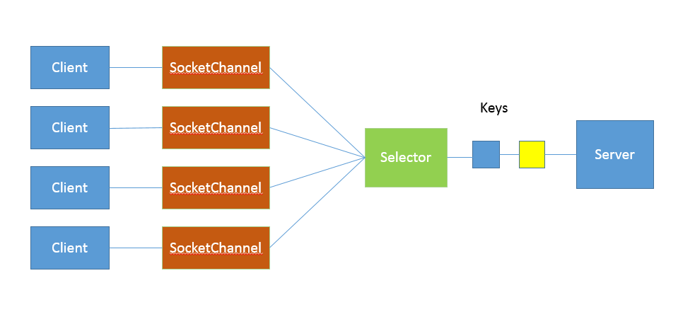

在 Java 7 引入的 NIO 2 中，又增添了一种额外的异步 IO 模式，利用事件和回调，处理 Accept、Read 等操作。 AIO 实现看起来是类似这样子：

``` java
AsynchronousServerSocketChannel serverSock = AsynchronousServerSocketChannel.open().bind(sockAddr);
serverSock.accept(serverSock, new CompletionHandler<>() { // 为异步操作指定 CompletionHandler 回调函数
    @Override
    public void completed(AsynchronousSocketChannel sockChannel, AsynchronousServerSocketChannel serverSock) {
        serverSock.accept(serverSock, this);
        // 另外一个 write（sock，CompletionHandler{}）
        sayHelloWorld(sockChannel, Charset.defaultCharset().encode("Hello World!"));
    }
  // 省略其他路径处理方法...
});
```
#### 3.2.3 Netty

按照官方定义，Netty是一个异步的、基于事件 Client/Server 的网络框架，目标是提供一种简单、快速构建网络应用的方式，同时保证高吞吐量、低延时、高可靠性。单独从性能角度，Netty 在基础的 NIO 等类库之上进行了很多改进，例如：

- 更加优雅的 Reactor 模式实现、灵活的线程模型、利用 EventLoop 等创新性的机制，可以非常高效地管理成百上千的 Channel。
- 充分利用了 Java 的 Zero-Copy 机制，并且从多种角度，“斤斤计较”般的降低内存分配和回收的开销。例如，使用池化的 Direct Buffer 等技术，在提高 IO 性能的同时，减少了对象的创建和销毁；利用反射等技术直接操纵 SelectionKey，使用数组而不是 Java 容器等。
- 使用更多本地代码。例如，直接利用 JNI 调用 Open SSL 等方式，获得比 Java 内建 SSL 引擎更好的性能。
- 在通信协议、序列化等其他角度的优化。

总的来说，Netty 并没有 Java 核心类库那些强烈的通用性、跨平台等各种负担，针对性能等特定目标以及 Linux 等特定环境，采取了一些极致的优化手段。

从设计思路和目的上，Netty 与 Java 自身的 NIO 框架相比有哪些不同呢？
我们知道 Java 的标准类库，由于其基础性、通用性的定位，往往过于关注技术模型上的抽象，而不是从一线应用开发者的角度去思考。我曾提到过，引入并发包的一个重要原因就是，应用开发者使用 Thread API 比较痛苦，需要操心的不仅仅是业务逻辑，而且还要自己负责将其映射到 Thread 模型上。Java NIO 的设计也有类似的特点，开发者需要深入掌握线程、IO、网络等相关概念，学习路径很长，很容易导致代码复杂、晦涩，即使是有经验的工程师，也难以快速地写出高可靠性的实现。

Netty 的设计强调了 “Separation Of Concerns”，通过精巧设计的事件机制，将业务逻辑和无关技术逻辑进行隔离，并通过各种方便的抽象，一定程度上填补了了基础平台和业务开发之间的鸿沟，更有利于在应用开发中普及业界的最佳实践。简单的来说：Netty > java.nio + java. net！从 API 能力范围来看，Netty 完全是 Java NIO 框架的一个大大的超集，你可以参考 Netty 官方的模块划分。

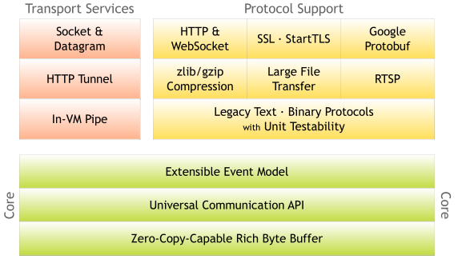

除了核心的事件机制等，Netty 还额外提供了很多功能，例如：

- 从网络协议的角度，Netty 除了支持传输层的 UDP、TCP、SCTP协议，也支持 HTTP(s)、WebSocket 等多种应用层协议，它并不是单一协议的 API。
- 在应用中，需要将数据从 Java 对象转换成为各种应用协议的数据格式，或者进行反向的转换，Netty 为此提供了一系列扩展的编解码框架，与应用开发场景无缝衔接，并且性能良好。
- 它扩展了 Java NIO Buffer，提供了自己的 ByteBuf 实现，并且深度支持 Direct Buffer 等技术，甚至 hack 了 Java 内部对 Direct Buffer 的分配和销毁等。同时，Netty 也提供了更加完善的 Scatter/Gather 机制实现。
可以看到，Netty 的能力范围大大超过了 Java 核心类库中的 NIO 等 API，可以说它是一个从应用视角出发的产物。

下图是 Netty 官方提供的 Server 部分:

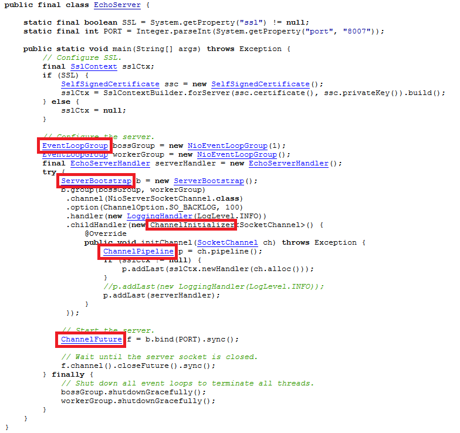

上面的例子，虽然代码很短，但已经足够体现出 Netty 的几个核心概念，请注意我用红框标记出的部分：

ServerBootstrap，服务器端程序的入口，这是 Netty 为简化网络程序配置和关闭等生命周期管理，所引入的 Bootstrapping 机制。我们通常要做的创建 Channel、绑定端口、注册 Handler 等，都可以通过这个统一的入口，以Fluent API 等形式完成，相对简化了 API 使用。与之相对应， Bootstrap则是 Client 端的通常入口。
Channel，作为一个基于 NIO 的扩展框架，Channel 和 Selector 等概念仍然是 Netty 的基础组件，但是针对应用开发具体需求，提供了相对易用的抽象。
EventLoop，这是 Netty 处理事件的核心机制。例子中使用了 EventLoopGroup。我们在 NIO 中通常要做的几件事情，如注册感兴趣的事件、调度相应的 Handler 等，都是 EventLoop 负责。
ChannelFuture，这是 Netty 实现异步 IO 的基础之一，保证了同一个 Channel 操作的调用顺序。Netty 扩展了 Java 标准的 Future，提供了针对自己场景的特有Future定义。
ChannelHandler，这是应用开发者放置业务逻辑的主要地方，也是我上面提到的“Separation Of Concerns”原则的体现。
ChannelPipeline，它是 ChannelHandler 链条的容器，每个 Channel 在创建后，自动被分配一个 ChannelPipeline。在上面的示例中，我们通过 ServerBootstrap 注册了 ChannelInitializer，并且实现了 initChannel 方法，而在该方法中则承担了向 ChannelPipleline 安装其他 Handler 的任务。

参考下面的简化示意图，忽略 Inbound/OutBound Handler 的细节，理解这几个基本单元之间的操作流程和对应关系。

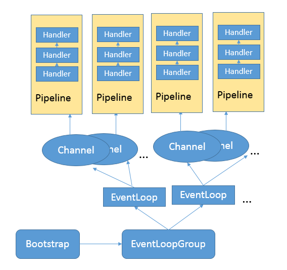

对比 Java 标准 NIO 的代码，Netty 提供的相对高层次的封装，减少了对 Selector 等细节的操纵，而 EventLoop、Pipeline 等机制则简化了编程模型，开发者不用担心并发等问题，在一定程度上简化了应用代码的开发。最难能可贵的是，这一切并没有以可靠性、可扩展性为代价，反而将其大幅度提高。


#### 3.2.4 java文件拷贝
* 利用 java.io 类库，直接为源文件构建一个 FileInputStream 读取，然后再为目标文件构建一个 FileOutputStream，完成写入工作。
* 利用 java.nio 类库提供的 transferTo 或 transferFrom 方法实现。
* Java 标准类库本身已经提供了几种 Files.copy 的实现。
NIO transferTo/From 的方式可能更快，因为它更能利用现代操作系统底层机制，避免不必要拷贝和上下文切换。

操作系统把内存分为用户态空间（User Space）和内核态空间（Kernel Space）当我们使用输入输出流进行读写时，实际上是进行了多次上下文切换，比如应用读取数据时，先在内核态将数据从磁盘读取到内核缓存，再切换到用户态将数据从内核缓存读取到用户缓存。写入操作也是类似，仅仅是步骤相反。

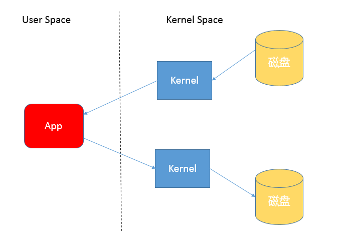

所以，这种方式会带来一定的额外开销，可能会降低 IO 效率。而基于 NIO transferTo 的实现方式，在 Linux 和 Unix 上，则会使用到零拷贝技术，数据传输并不需要用户态参与，省去了上下文切换的开销和不必要的内存拷贝，进而可能提高应用拷贝性能。注意，transferTo 不仅仅是可以用在文件拷贝中，与其类似的，例如读取磁盘文件，然后进行 Socket 发送，同样可以享受这种机制带来的性能和扩展性提高。


### 3.3 线程安全
线程安全是一个多线程环境下正确性的概念，也就是保证多线程环境下共享的、可修改的状态的正确性，这里的状态反映在程序中其实可以看作是数据。换个角度来看，如果状态不是共享的，或者不是可修改的，也就不存在线程安全问题

保证线程安全的两个办法：
* 封装：通过封装，我们可以将对象内部状态隐藏、保护起来。
* 不可变：还记得我们在专栏第 3 讲强调的 final 和 immutable 吗，就是这个道理，Java 语言目前还没有真正意义上的原生不可变，但是未来也许会引入。

线程安全需要保证几个基本特性：
* 原子性，简单说就是相关操作不会中途被其他线程干扰，一般通过同步机制实现。
* 可见性，是一个线程修改了某个共享变量，其状态能够立即被其他线程知晓，通常被解释为将线程本地状态反映到主内存上，volatile 就是负责保证可见性的。
* 有序性，是保证线程内串行语义，避免指令重排等。

Java中除了 synchronized 和 ReentrantLock，Java 核心类库中还有其他一些特别的锁类型，具体请参考下面的图。

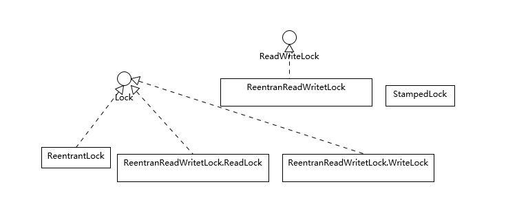

在Java中锁斌不是都是实现了 Lock 接口，ReadWriteLock 是一个单独的接口，它通常是代表了一对儿锁，分别对应只读和写操作，标准类库中提供了再入版本的读写锁实现（ReentrantReadWriteLock），对应的语义和 ReentrantLock 比较相似。

StampedLock 也是个单独的类型，从类图结构可以看出它是不支持再入性的语义的，也就是它不是以持有锁的线程为单位。

为什么我们需要读写锁（ReadWriteLock）等其他锁呢？这是因为，虽然 ReentrantLock 和 synchronized 简单实用，但是行为上有一定局限性，通俗点说就是“太霸道”，要么不占，要么独占。实际应用场景中，有的时候不需要大量竞争的写操作，而是以并发读取为主，如何进一步优化并发操作的粒度呢？基于多个读操作是不需要互斥的原因，读操作并不会更改数据，所以不存在互相干扰。而写操作则会导致并发一致性的问题，所以写线程之间、读写线程之间，需要精心设计的互斥逻辑。下面是一个基于读写锁实现的数据结构，当数据量较大，并发读多、并发写少的时候，能够比纯同步版本凸显出优势。

``` java
public class RWSample {
    private final Map<String, String> m = new TreeMap<>();
    private final ReentrantReadWriteLock rwl = new ReentrantReadWriteLock();
    private final Lock r = rwl.readLock();
    private final Lock w = rwl.writeLock();

    public String get(String key) {
        r.lock();
        System.out.println(" 读锁锁定！");
        try {
            return m.get(key);
        } finally {
            r.unlock();
        }
    }

    public String put(String key, String entry) {
        w.lock();
        System.out.println(" 写锁锁定！");
        try {
            return m.put(key, entry);
        } finally {
            w.unlock();
        }
    }
    // …
}
```
在运行过程中，如果读锁试图锁定时，写锁是被某个线程持有，读锁将无法获得，而只好等待对方操作结束，这样就可以自动保证不会读取到有争议的数据。读写锁看起来比 synchronized 的粒度似乎细一些，但在实际应用中，其表现也并不尽如人意，主要还是因为相对比较大的开销。

所以，在Java8引入了 StampedLock，在提供类似读写锁的同时，还支持优化读模式。优化读基于假设，大多数情况下读操作并不会和写操作冲突，其逻辑是先试着读，然后通过 validate 方法确认是否进入了写模式，如果没有进入，就成功避免了开销；如果进入，则尝试获取读锁。这种读锁是一种乐观锁。

**synchronized 和 lock 的区别**

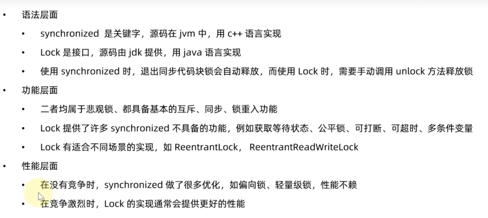


#### 3.3.1 synchronized
synchronized属于独占锁、悲观锁，它是在假设一定会发生冲突的，当一个线程已经获取当前锁时，其他试图获取的线程只能等待或者阻塞在那里。
在 Java 5 以前，synchronized 是仅有的同步手段， Java 5 提供了ReentrantLock，通常翻译为再入锁，它的语义和 synchronized 基本相同。再入锁通过代码直接调用 lock() 方法获取，代码书写也更加灵活。synchronized 和 ReentrantLock 的性能不能一概而论，早期版本 synchronized 在很多场景下性能相差较大，在后续版本进行了较多改进，在低竞争场景中表现可能优于 ReentrantLock。

``` java
public class SyncTest {
    // 修饰代码块，指定加锁对象，对给定对象加锁，进入同步代码块前要获得给定对象的锁。
    public void syncBlock(){
        synchronized (this){
            System.out.println("hello block");
        }
    }
    // 修饰实例方法，为当前实例加锁，进入同步方法前要获得当前实例的锁。
    public synchronized void syncMethod(){
        System.out.println("hello method");
    }
    // 修饰静态方法，为当前类对象加锁，进入同步方法前要获得当前类对象的锁。
    public static synchronized void syncMethod(){
        System.out.println("hello method");
    }
}
```
synchronized修饰语句块：javac在编译时，会方法块的进入和退出时生成monitorenter和monitorexit指令，有两个monitorexit指令的原因是为了保证抛异常的情况下也能释放锁，所以javac为同步代码块添加了一个隐式的try-finally，在finally中会调用monitorexit命令释放锁。monitorenter，monitorexit指令主要是获取和释放监视器锁，而且在java中每个对象都关联一个监视器。如果monitor没有被任何线程获取，那么当前线程获取这个monitor，把monitor的entry count设置为1，表示这个monitor被1个线程占用了，该线程再次进入时会将entry count再次+1，执行monitorexit指令时将entry count循环-1直到entry count变为0释放monitor，其他线程想要进入同步代码块，需要等到entry count为0时获得monitor才能进入。当前线程获取了monitor之后，会增加这个monitor的时间计数，来记录当前线程占用了monitor多长时间。

synchronized修饰方法：javac为其生成了一个ACC_SYNCHRONIZED关键字，在JVM进行方法调用时，检查该方法在常量池中是否包含 ACC_SYNCHRONIZED 标记符，如果有，JVM 要求线程在调用之前请求锁，修饰静态方法和实例方法不同的地方就是作为互斥的对象不同。

在 Java 6 之前，Monitor 的实现完全是依靠操作系统内部的互斥锁，因为需要进行用户态到内核态的切换，所以同步操作是一个无差别的重量级操作，Java 6之后JVM 对此进行了大刀阔斧地改进，提供了三种不同的 Monitor 实现，也就是常说的三种不同的锁：偏斜锁（Biased Locking）、轻量级锁和重量级锁，大大改进了其性能。

所谓锁的升级、降级，就是 JVM 优化 synchronized 运行的机制，当 JVM 检测到不同的竞争状况时，会自动切换到适合的锁实现，这种切换就是锁的升级、降级。当没有竞争出现时，默认会使用偏斜锁。JVM 会利用 CAS 操作（compare and swap），在对象头上的 Mark Word 部分设置线程 ID，以表示这个对象偏向于当前线程，所以并不涉及真正的互斥锁。这样做的假设是基于在很多应用场景中，大部分对象生命周期中最多会被一个线程锁定，使用偏斜锁可以降低无竞争开销。

如果有另外的线程试图锁定某个已经被偏斜过的对象，JVM 就需要撤销（revoke）偏斜锁，并切换到轻量级锁实现。轻量级锁依赖 CAS 操作 Mark Word 来试图获取锁，如果重试成功，就使用普通的轻量级锁；否则，进一步升级为重量级锁。

我注意到有的观点认为 Java 不会进行锁降级。实际上据我所知，锁降级确实是会发生的，当 JVM 进入安全点（SafePoint）的时候，会检查是否有闲置的 Monitor，然后试图进行降级。

偏斜锁并不适合所有应用场景，撤销操作（revoke）是比较重的行为，只有当存在较多不会真正竞争的 synchronized 块儿时，才能体现出明显改善。实践中对于偏斜锁的一直是有争议的，有人甚至认为，当你需要大量使用并发类库时，往往意味着你不需要偏斜锁。从具体选择来看，我还是建议需要在实践中进行测试，根据结果再决定是否使用。偏斜锁会延缓 JIT 预热的进程，所以很多性能测试中会显式地关闭偏斜锁， JVM 启动时，我们可以指定是否开启偏斜锁，`-XX:-UseBiasedLocking`


#### 3.3.2 ReentrantLock
再入锁是表示当一个线程试图获取一个它已经获取的锁时，这个获取动作就自动成功，这是对锁获取粒度的一个概念，也就是锁的持有是以线程为单位而不是基于调用次数。Java 锁实现强调再入性是为了和 pthread 的行为进行区分。

再入锁可以设置公平性（fairness），我们可在创建再入锁时选择是否是公平的。`new ReentrantLock(true);` 这里所谓的公平性是指在竞争场景中，当公平性为真时，会倾向于将锁赋予等待时间最久的线程。公平性是减少线程“饥饿”（个别线程长期等待锁，但始终无法获取）情况发生的一个办法。

``` java
// 这里是演示创建公平锁，一般情况不需要。
ReentrantLock fairLock = new ReentrantLock(true);
fairLock.lock();
try {
	// do something
} finally {
 	fairLock.unlock();
}
```

ReentrantLock 相比 synchronized，因为可以像普通对象一样使用，所以可以利用其提供的各种便利方法，进行精细的同步操作，甚至是实现 synchronized 难以表达的用例，例如：带超时的获取锁尝试、可以判断是否有线程，或者某个特定线程，在排队等待获取锁、可以响应中断请求…
这里我特别想强调条件变量（java.util.concurrent.Condition），如果说 ReentrantLock 是 synchronized 的替代选择，Condition 则是将 wait、notify、notifyAll 等操作转化为相应的对象，将复杂而晦涩的同步操作转变为直观可控的对象行为。

ReentrantLock支持公平锁和非公平锁，并且ReentrantLock的底层就是由AQS来实现的，非公平锁源码中的加锁流程如下：

``` java
// java.util.concurrent.locks.ReentrantLock#NonfairSync
// 非公平锁
static final class NonfairSync extends Sync {
	...
	final void lock() {
		if (compareAndSetState(0, 1))
			setExclusiveOwnerThread(Thread.currentThread());
		else
			acquire(1);
		}
  ...
}
```
这块代码的含义为：若通过CAS设置变量State（同步状态）成功，也就是获取锁成功，则将当前线程设置为独占线程。若通过CAS设置变量State（同步状态）失败，也就是获取锁失败，则进入Acquire方法进行后续处理。我们再看下公平锁的源码：
``` java
// java.util.concurrent.locks.ReentrantLock#FairSync
static final class FairSync extends Sync {
  ...  
	final void lock() {
		acquire(1);
	}
  ...
}
```
结合公平锁和非公平锁的加锁流程，虽然流程上有一定的不同，但是都调用了Acquire方法，而Acquire方法是FairSync和UnfairSync的父类AQS（AbstractQueuedSynchronizer）中的核心方法。其实在ReentrantLock类源码中都无法解答，而这些问题的答案，都是位于Acquire方法所在的类AbstractQueuedSynchronizer中。
AQS核心思想是，如果被请求的共享资源空闲，那么就将当前请求资源的线程设置为有效的工作线程，将共享资源设置为锁定状态；如果共享资源被占用，就需要一定的阻塞等待唤醒机制来保证锁分配。这个机制主要用的是CLH队列的变体实现的，将暂时获取不到锁的线程加入到队列中。
CLH：Craig、Landin and Hagersten队列，是单向链表，AQS中的队列是CLH变体的虚拟双向队列（FIFO），AQS是通过将每条请求共享资源的线程封装成一个节点来实现锁的分配。


AQS使用一个Volatile的int类型的成员变量来表示同步状态，通过内置的FIFO队列来完成资源获取的排队工作，通过CAS完成对State值的修改。

#### 3.3.3 Hapen-Before
Happen-before 关系，是 Java 内存模型中保证多线程操作可见性的机制，也是对早期语言规范中含糊的可见性概念的一个精确定义。它的具体表现形式，包括但远不止是我们直觉中的 synchronized、volatile、lock 操作顺序等方面，例如：

* 线程内执行的每个操作，都保证 happen-before 后面的操作，这就保证了基本的程序顺序规则，这是开发者在书写程序时的基本约定。
* 对于 volatile 变量，对它的写操作，保证 happen-before 在随后对该变量的读取操作。
* 对于一个锁的解锁操作，保证 happen-before 加锁操作。
* 对象构建完成，保证 happen-before 于 finalizer 的开始动作。
* 甚至是类似线程内部操作的完成，保证 happen-before 其他 Thread.join() 的线程等。
这些 happen-before 关系是存在着传递性的，如果满足 a happen-before b 和 b happen-before c，那么 a happen-before c 也成立。

前面我一直用 happen-before，而不是简单说前后，是因为它不仅仅是对执行时间的保证，也包括对内存读、写操作顺序的保证。仅仅是时钟顺序上的先后，并不能保证线程交互的可见性。

#### 3.3.4 避免死锁

* 如果可能的话，尽量避免使用多个锁，并且只有需要时才持有锁。否则，即使是非常精通并发编程的工程师，也难免会掉进坑里，嵌套的 synchronized 或者 lock 非常容易出问题。
* 如果必须使用多个锁，尽量设计好锁的获取顺序，这个说起来简单，做起来可不容易，你可以参看著名的银行家算法
* 使用带超时的方法，为程序带来更多可控性。类似 Object.wait(…) 或者 CountDownLatch.await(…)，都支持所谓的 timed_wait，我们完全可以就不假定该锁一定会获得，指定超时时间，并为无法得到锁时准备退出逻辑。

业界也有一些其他方面的尝试，比如通过静态代码分析（如 FindBugs）去查找固定的模式，进而定位可能的死锁或者竞争情况。除了典型应用中的死锁场景，其实还有一些更令人头疼的死锁，比如类加载过程发生的死锁，尤其是在框架大量使用自定义类加载时，因为往往不是在应用本身的代码库中，jstack 等工具也不见得能够显示全部锁信息，所以处理起来比较棘手。

### 3.4 线程状态

关于线程生命周期的不同状态，在 Java 5 以后，线程状态被明确定义在其公共内部枚举类型 java.lang.Thread.State 中，分别是：

* 新建（NEW），表示线程被创建出来还没真正启动的状态，可以认为它是个 Java 内部状态。
* 就绪（RUNNABLE），表示该线程已经在 JVM 中执行，当然由于执行需要计算资源，它可能是正在运行，也可能还在等待系统分配给它 CPU 片段，在就绪队列里面排队。
* 在其他一些分析中，会额外区分一种状态 RUNNING，但是从 Java API 的角度，并不能表示出来。
* 阻塞（BLOCKED），这个状态和我们前面两讲介绍的同步非常相关，阻塞表示线程在等待 Monitor lock。比如，线程试图通过 synchronized 去获取某个锁，但是其他线程已经独占了，那么当前线程就会处于阻塞状态。
* 等待（WAITING），表示正在等待其他线程采取某些操作。一个常见的场景是类似生产者消费者模式，发现任务条件尚未满足，就让当前消费者线程等待（wait），另外的生产者线程去准备任务数据，然后通过类似 notify 等动作，通知消费线程可以继续工作了。Thread.join() 也会令线程进入等待状态。
* 计时等待（TIMED_WAIT），其进入条件和等待状态类似，但是调用的是存在超时条件的方法，比如 wait 或 join 等方法的指定超时版本，如
* 终止（TERMINATED），不管是意外退出还是正常执行结束，线程已经完成使命，终止运行，也有人把这个状态叫作死亡。

在第二次调用 start() 方法的时候，线程可能处于终止或者其他（非 NEW）状态，但是不论如何，都是不可以再次启动的。第二次调用必然会抛出 IllegalThreadStateException，这是一种运行时异常，多次调用 start 被认为是编程错误。

从线程生命周期的状态开始展开，那么在 Java 编程中，有哪些因素可能影响线程的状态呢？主要有：

线程自身的方法，除了 start，还有多个 join 方法，等待线程结束；yield 是告诉调度器，主动让出 CPU；另外，就是一些已经被标记为过时的 resume、stop、suspend 之类，据我所知，在 JDK 最新版本中，destory/stop 方法将被直接移除。
基类 Object 提供了一些基础的 wait/notify/notifyAll 方法。如果我们持有某个对象的 Monitor 锁，调用 wait 会让当前线程处于等待状态，直到其他线程 notify 或者 notifyAll。所以，本质上是提供了 Monitor 的获取和释放的能力，是基本的线程间通信方式。
并发类库中的工具，比如 CountDownLatch.await() 会让当前线程进入等待状态，直到 latch 被基数为 0，这可以看作是线程间通信的 Signal。

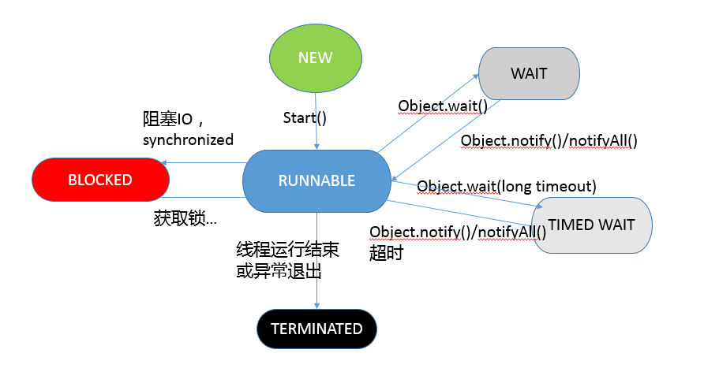

Thread 和 Object 的方法，听起来简单，但是实际应用中被证明非常晦涩、易错，Java 后来又引入了并发包。总的来说，有了并发包，大多数情况下，我们已经不再需要去调用 wait/notify 之类的方法了。

### 3.5 线程池
通常开发者都是利用 Executors 提供的通用线程池创建方法，去创建不同配置的线程池，主要区别在于不同的 ExecutorService 类型或者不同的初始参数。
Executors 目前提供了 5 种不同的线程池创建配置：
* newCachedThreadPool()，它是一种用来处理大量短时间工作任务的线程池，具有几个鲜明特点：它会试图缓存线程并重用，当无缓存线程可用时，就会创建新的工作线程；如果线程闲置的时间超过 60 秒，则被终止并移出缓存；长时间闲置时，这种线程池，不会消耗什么资源。其内部使用 SynchronousQueue 作为工作队列。
* newFixedThreadPool(int nThreads)，重用指定数目（nThreads）的线程，其背后使用的是无界的工作队列，任何时候最多有 nThreads 个工作线程是活动的。这意味着，如果任务数量超过了活动队列数目，将在工作队列中等待空闲线程出现；如果有工作线程退出，将会有新的工作线程被创建，以补足指定的数目 nThreads。
* newSingleThreadExecutor()，它的特点在于工作线程数目被限制为 1，操作一个无界的工作队列，所以它保证了所有任务的都是被顺序执行，最多会有一个任务处于活动状态，并且不允许使用者改动线程池实例，因此可以避免其改变线程数目。
* newSingleThreadScheduledExecutor() 和 newScheduledThreadPool(int corePoolSize)，创建的是个 ScheduledExecutorService，可以进行定时或周期性的工作调度，区别在于单一工作线程还是多个工作线程。
* newWorkStealingPool(int parallelism)，这是一个经常被人忽略的线程池，Java 8 才加入这个创建方法，其内部会构建ForkJoinPool，利用Work-Stealing算法，并行地处理任务，不保证处理顺序。

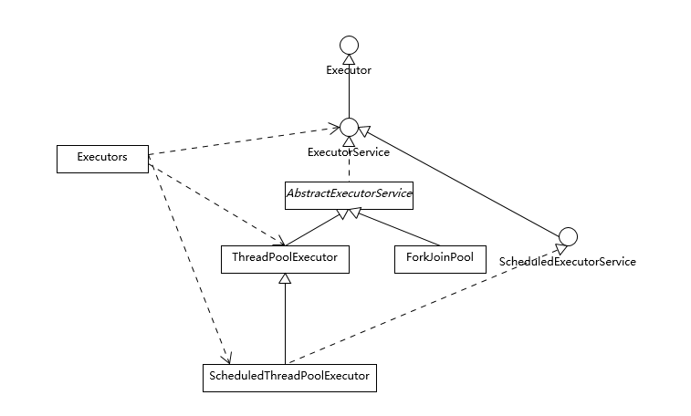

从上图可以看出Executor 是一个基础的接口，其初衷是将任务提交和任务执行细节解耦，这一点可以体会其定义的唯一方法。`void execute(Runnable command);`Executor 的设计是源于 Java 早期线程 API 使用的教训，开发者在实现应用逻辑时，被太多线程创建、调度等不相关细节所打扰。就像我们进行 HTTP 通信，如果还需要自己操作 TCP 握手，开发效率低下，质量也难以保证。
ExecutorService 则更加完善，不仅提供 service 的管理功能，比如 shutdown 等方法，也提供了更加全面的提交任务机制，如返回Future而不是 void 的 submit 方法。`<T> Future<T> submit(Callable<T> task);

Java 标准类库提供了几种基础实现，比如ThreadPoolExecutor、ScheduledThreadPoolExecutor、ForkJoinPool。这些线程池的设计特点在于其高度的可调节性和灵活性，以尽量满足复杂多变的实际应用场景，我会进一步分析其构建部分的源码，剖析这种灵活性的源头。
ScheduledThreadPoolExecutor 是 ThreadPoolExecutor 的扩展，主要是增加了调度逻辑，ForkJoinPool 则是为 ForkJoinTask 定制的线程池，与通常意义的线程池有所不同。下面是应用于线程交互：

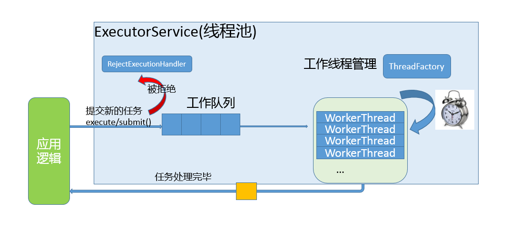

工作队列负责存储用户提交的各个任务，这个工作队列，可以是容量为 0 的 SynchronousQueue（使用 newCachedThreadPool），也可以是像固定大小线程池（newFixedThreadPool）那样使用 LinkedBlockingQueue。`private final BlockingQueue<Runnable> workQueue;`
内部的“线程池”，这是指保持工作线程的集合，线程池需要在运行过程中管理线程创建、销毁。例如，对于带缓存的线程池，当任务压力较大时，线程池会创建新的工作线程；当业务压力退去，线程池会在闲置一段时间（默认 60 秒）后结束线程。`private final HashSet<Worker> workers = new HashSet<>();`

线程池的工作线程被抽象为静态内部类 Worker，基于AQS（基于AbstractQueuedSynchronizer，ReentrantLock公平锁也是基于AQS）实现。

- ThreadFactory 提供上面所需要的创建线程逻辑。
- 如果任务提交时被拒绝，比如线程池已经处于 SHUTDOWN 状态，需要为其提供处理逻辑，Java 标准库提供了类似[ThreadPoolExecutor.AbortPolicy](https://docs.oracle.com/javase/9/docs/api/java/util/concurrent/ThreadPoolExecutor.AbortPolicy.html)等默认实现，也可以按照实际需求自定义。

从上面的分析，就可以看出线程池的几个基本组成部分，一起都体现在线程池的构造函数中，从字面我们就可以大概猜测到其用意：

- corePoolSize，所谓的核心线程数，可以大致理解为长期驻留的线程数目（除非设置了 allowCoreThreadTimeOut）。对于不同的线程池，这个值可能会有很大区别，比如 newFixedThreadPool 会将其设置为 nThreads，而对于 newCachedThreadPool 则是为 0。
- maximumPoolSize，顾名思义，就是线程不够时能够创建的最大线程数。同样进行对比，对于 newFixedThreadPool，当然就是 nThreads，因为其要求是固定大小，而 newCachedThreadPool 则是 Integer.MAX_VALUE。
- keepAliveTime 和 TimeUnit，这两个参数指定了额外的线程能够闲置多久，显然有些线程池不需要它。
- workQueue，工作队列，必须是 BlockingQueue。

通过配置不同的参数，我们就可以创建出行为大相径庭的线程池，这就是线程池高度灵活性的基础。
``` java
public ThreadPoolExecutor(int corePoolSize, int maximumPoolSize, long keepAliveTime, TimeUnit unit,
                      	BlockingQueue<Runnable> workQueue, ThreadFactory threadFactory, RejectedExecutionHandler handler)
```
下图为线程的流转：

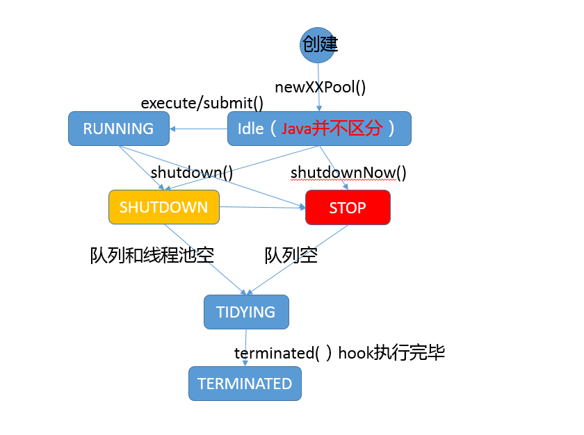

下面是execute 方法源码：

``` java
public void execute(Runnable command) {
…
	int c = ctl.get();
  // 检查工作线程数目，低于 corePoolSize 则添加 Worker
	if (workerCountOf(c) < corePoolSize) {
    	if (addWorker(command, true))
        	return;
    	c = ctl.get();
	}
  // isRunning 就是检查线程池是否被 shutdown
  // 工作队列可能是有界的，offer 是比较友好的入队方式
	if (isRunning(c) && workQueue.offer(command)) {
    	int recheck = ctl.get();
      // 再次进行防御性检查
    	if (! isRunning(recheck) && remove(command))
        	reject(command);
    	else if (workerCountOf(recheck) == 0)
        	addWorker(null, false);
	}
  // 尝试添加一个 worker，如果失败意味着已经饱和或者被 shutdown 了
	else if (!addWorker(command, false))
    	reject(command);
}
```

线程池虽然为提供了非常强大、方便的功能，但是也不是银弹，使用不当同样会导致问题。

- 避免任务堆积。前面我说过 newFixedThreadPool 是创建指定数目的线程，但是其工作队列是无界的，如果工作线程数目太少，导致处理跟不上入队的速度，这就很有可能占用大量系统内存，甚至是出现 OOM。诊断时，你可以使用 jmap 之类的工具，查看是否有大量的任务对象入队。
- 避免过度扩展线程。我们通常在处理大量短时任务时，使用缓存的线程池，比如在最新的 HTTP/2 client API 中，目前的默认实现就是如此。我们在创建线程池的时候，并不能准确预计任务压力有多大、数据特征是什么样子（大部分请求是 1K 、100K 还是 1M 以上？），所以很难明确设定一个线程数目。
- 另外，如果线程数目不断增长（可以使用 jstack 等工具检查），也需要警惕另外一种可能性，就是线程泄漏，这种情况往往是因为任务逻辑有问题，导致工作线程迟迟不能被释放。建议你排查下线程栈，很有可能多个线程都是卡在近似的代码处。
- 避免死锁等同步问题，对于死锁的场景和排查。
- 尽量避免在使用线程池时操作 ThreadLocal；

**线程池大小的选择策略**
- 如果我们的任务主要是进行计算，那么就意味着 CPU 的处理能力是稀缺的资源，我们能够通过大量增加线程数提高计算能力吗？往往是不能的，如果线程太多，反倒可能导致大量的上下文切换开销。所以，这种情况下，通常建议按照 CPU 核的数目 N 或者 N+1。
- 如果是需要较多等待的任务，例如 I/O 操作比较多，可以参考 Brain Goetz 推荐的计算方法：`线程数 = CPU 核数 × 目标 CPU 利用率 ×（1 + 平均等待时间 / 平均工作时间）`

### 3.6 JMM内存模型
Java 是最早尝试提供内存模型的语言，这是简化多线程编程、保证程序可移植性的一个飞跃。早期类似 C、C++ 等语言，并不存在内存模型的概念（C++ 11 中也引入了标准内存模型），其行为依赖于处理器本身的内存一致性模型，但不同的处理器可能差异很大，所以一段 C++ 程序在处理器 A 上运行正常，并不能保证其在处理器 B 上也是一致的。

即使如此，最初的 Java 语言规范仍然是存在着缺陷的，当时的目标是，希望 Java 程序可以充分利用现代硬件的计算能力，同时保持“书写一次，到处执行”的能力。

但是，显然问题的复杂度被低估了，随着 Java 被运行在越来越多的平台上，人们发现，过于泛泛的内存模型定义，存在很多模棱两可之处，对 synchronized 或 volatile 等，类似指令重排序时的行为，并没有提供清晰规范。这里说的指令重排序，既可以是编译器优化行为，也可能是源自于现代处理器的乱序执行等。

- 既不能保证一些多线程程序的正确性，例如最著名的就是双检锁（Double-Checked Locking，DCL）的失效问题，具体可以参考我在[第 14 讲](http://time.geekbang.org/column/article/8624)对单例模式的说明，双检锁可能导致未完整初始化的对象被访问，理论上这叫并发编程中的安全发布（Safe Publication）失败。
- 也不能保证同一段程序在不同的处理器架构上表现一致，例如有的处理器支持缓存一致性，有的不支持，各自都有自己的内存排序模型。

对于编译器、JVM 开发者，关注点可能是如何使用类似[内存屏障](https://en.wikipedia.org/wiki/Memory_barrier)（Memory-Barrier）之类技术，保证执行结果符合 JMM 的推断。对于 Java 应用开发者，则可能更加关注 volatile、synchronized 等语义，如何利用类似 happen-before 的规则，写出可靠的多线程应用，而不是利用一些“秘籍”去糊弄编译器、JVM。

我画了一个简单的角色层次图，不同工程师分工合作，其实所处的层面是有区别的。JMM 为 Java 工程师隔离了不同处理器内存排序的区别，这也是为什么我通常不建议过早深入处理器体系结构，某种意义上来说，这样本就违背了 JMM 的初衷。

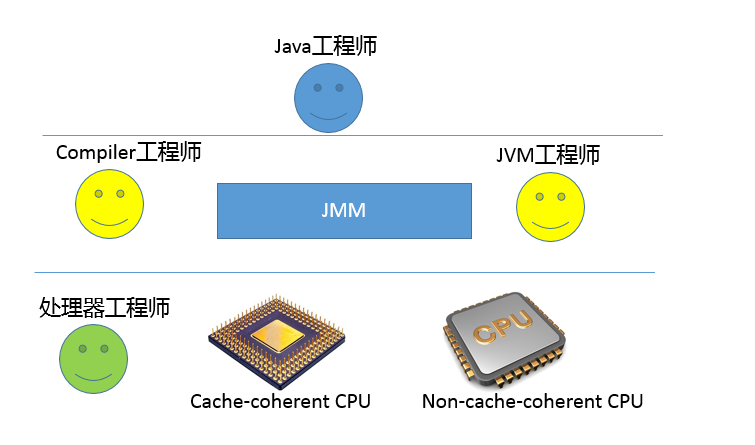

 JVM 内部的运行时数据区，但是真正程序执行，实际是要跑在具体的处理器内核上。你可以简单理解为，把本地变量等数据从内存加载到缓存、寄存器，然后运算结束写回主内存。你可以从下面示意图，看这两种模型的对应。

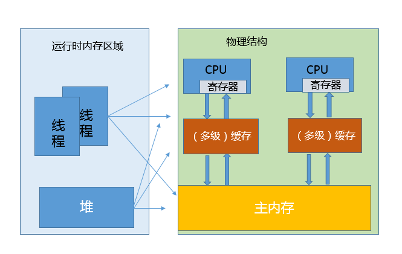

看上去很美好，但是当多线程共享变量时，情况就复杂了。试想，如果处理器对某个共享变量进行了修改，可能只是体现在该内核的缓存里，这是个本地状态，而运行在其他内核上的线程，可能还是加载的旧状态，这很可能导致一致性的问题。从理论上来说，多线程共享引入了复杂的数据依赖性，不管编译器、处理器怎么做重排序，都必须尊重数据依赖性的要求，否则就打破了正确性！这就是 JMM 所要解决的问题。

JMM 内部的实现通常是依赖于所谓的内存屏障，通过禁止某些重排序的方式，提供内存可见性保证，也就是实现了各种 happen-before 规则。与此同时，更多复杂度在于，需要尽量确保各种编译器、各种体系结构的处理器，都能够提供一致的行为。

以 volatile 为例，看看如何利用内存屏障实现 JMM 定义的可见性？对于一个 volatile 变量：

- 对该变量的写操作**之后**，编译器会插入一个**写屏障**。
- 对该变量的读操作**之前**，编译器会插入一个**读屏障**。

内存屏障能够在类似变量读、写操作之后，保证其他线程对 volatile 变量的修改对当前线程可见，或者本地修改对其他线程提供可见性。换句话说，线程写入，写屏障会通过类似强迫刷出处理器缓存的方式，让其他线程能够拿到最新数值。


### 3.7 JVM 内存结构

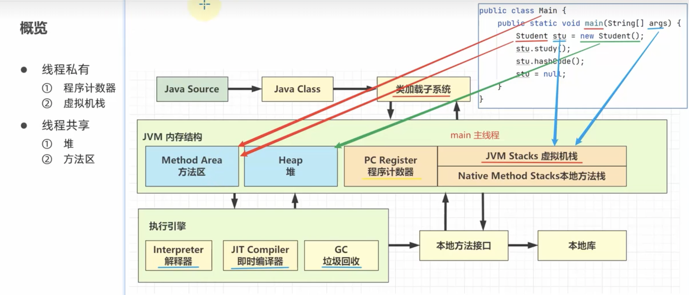

### 3.8 threadLocal

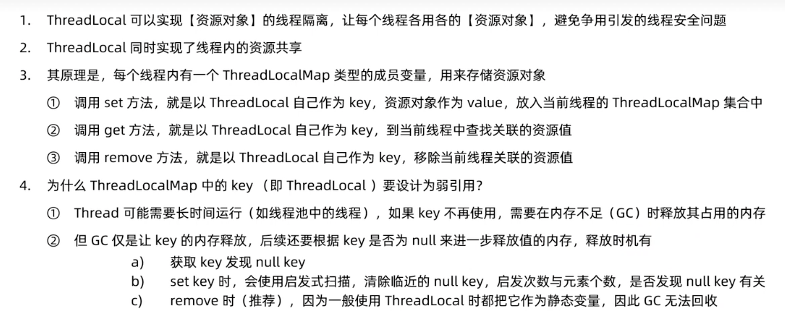


## 名词解释

### 1. fail-fast
在系统设计中，快速失效系统一种可以立即报告任何可能表明故障的情况的系统。快速失效系统通常设计用于停止正常操作，而不是试图继续可能存在缺陷的过程。这种设计通常会在操作中的多个点检查系统的状态，因此可以及早检测到任何故障。快速失败模块的职责是检测错误，然后让系统的下一个最高级别处理错误。

``` java
for (String userName : userNames) {
    if (userName.equals("Hollis")) {
        userNames.remove(userName);
    }
}
```
上面代码中foreach 循环里进行元素的 remove/add 操作，运行程序会报`ConcurrentModificationException`这其实也是运用了fail-fast机制。我们剖析下源码发现在增强for循环中，集合遍历是通过iterator进行的，而在`iterator.next()`方法中我们发现下面的代码：
​``` java
final void checkForComodification() {
    if (modCount != expectedModCount)
        throw new ConcurrentModificationException();
}

会在上面的代码中发现`modCount` 是ArrayList中的一个成员变量。它表示该集合实际被修改的次数，数组初始化时默认值为0。`expectedModCount` 是 ArrayList中的一个内部类，也是iterator中的成员变量，它表示这个迭代器预期该集合被修改的次数，值随着Itr被创建而初始化。那么，接着我们看下`userNames.remove(userName);`里面做了什么事情，为什么会导致`expectedModCount`和`modCount`不一样。通过翻阅代码，我们也可以发现，remove方法核心逻辑如下：

```
private void fastRemove(int index) {
    modCount++;
    int numMoved = size - index - 1;
    if (numMoved > 0)
        System.arraycopy(elementData, index+1, elementData, index,
                         numMoved);
    elementData[--size] = null; // clear to let GC do its work
}
```
可以看到，它只修改了modCount，并没有对expectedModCount做任何操作。

画一张图理解一下

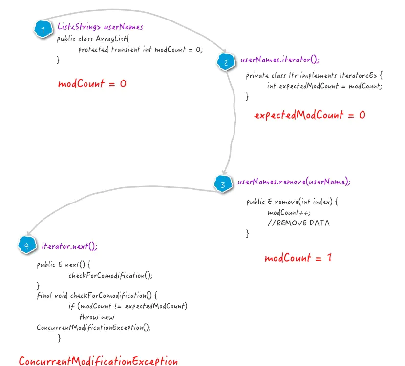

所以，在使用Java的集合类的时候，如果发生CMException，优先考虑fail-fast有关的情况，实际上这里并没有真的发生并发，只是Iterator使用了fail-fast的保护机制，只要他发现有某一次修改是未经过自己进行的，那么就会抛出异常。

### 2. java运算符
&（按位与）、&&（逻辑与）、|（按位或）、||（逻辑或）、^（异或运算符），与运算、或运算和异或运算，最终都会把运算符两端的值转换成二进制，然后再进行运算。

<<（左移运算符）、>>（右移运算符）、~（取反运算符）、>>>（无符号右移运算符），先把计算的对象转化为二进制，然后进行二进制位数的移动。

### 3. unseaf
Unsafe是位于sun.misc包下的一个类，主要提供一些用于执行低级别、不安全操作的方法，如直接访问系统内存资源、自主管理内存资源等，这些方法在提升Java运行效率、增强Java语言底层资源操作能力方面起到了很大的作用。但由于Unsafe类使Java语言拥有了类似C语言指针一样操作内存空间的能力，这无疑也增加了程序发生相关指针问题的风险。在程序中过度、不正确使用Unsafe类会使得程序出错的概率变大，使得Java这种安全的语言变得不再“安全”，因此对Unsafe的使用一定要慎重。Unsafe类为一单例实现，提供静态方法getUnsafe获取Unsafe实例，当且仅当调用getUnsafe方法的类为引导类加载器所加载时才合法。Unsafe提供的API大致可分为内存操作、CAS、Class相关、对象操作、线程调度、系统信息获取、内存屏障、数组操作等几类，下面将对其相关方法和应用场景进行详细介绍。

#### 3.1 内存操作
这部分主要包含堆外内存的分配、拷贝、释放、给定地址值操作等方法。通常，我们在Java中创建的对象都处于堆内内存（heap）中，堆内内存是由JVM所管控的Java进程内存，并且它们遵循JVM的内存管理机制，JVM会采用垃圾回收机制统一管理堆内存。与之相对的是堆外内存，存在于JVM管控之外的内存区域，Java中对堆外内存的操作，依赖于Unsafe提供的操作堆外内存的native方法。
``` java
//分配内存, 相当于C++的malloc函数
public native long allocateMemory(long bytes);
//扩充内存
public native long reallocateMemory(long address, long bytes);
//释放内存
public native void freeMemory(long address);
//在给定的内存块中设置值
public native void setMemory(Object o, long offset, long bytes, byte value);
//内存拷贝
public native void copyMemory(Object srcBase, long srcOffset, Object destBase, long destOffset, long bytes);
//获取给定地址值，忽略修饰限定符的访问限制。与此类似操作还有: getInt，getDouble，getLong，getChar等
public native Object getObject(Object o, long offset);
//为给定地址设置值，忽略修饰限定符的访问限制，与此类似操作还有: putInt,putDouble，putLong，putChar等
public native void putObject(Object o, long offset, Object x);
//获取给定地址的byte类型的值（当且仅当该内存地址为allocateMemory分配时，此方法结果为确定的）
public native byte getByte(long address);
//为给定地址设置byte类型的值（当且仅当该内存地址为allocateMemory分配时，此方法结果才是确定的）
public native void putByte(long address, byte x);
```
使用堆外内存的原因:
* 对垃圾回收停顿的改善。由于堆外内存是直接受操作系统管理而不是JVM，所以当我们使用堆外内存时，即可保持较小的堆内内存规模。从而在GC时减少回收停顿对于应用的影响。
* 提升程序I/O操作的性能。通常在I/O通信过程中，会存在堆内内存到堆外内存的数据拷贝操作，对于需要频繁进行内存间数据拷贝且生命周期较短的暂存数据，都建议存储到堆外内存。

#### 3.2 CAS相关

``` java
/**
	*  CAS
  * @param o         包含要修改field的对象
  * @param offset    对象中某field的偏移量
  * @param expected  期望值
  * @param update    更新值
  * @return          true | false
  */
public final native boolean compareAndSwapObject(Object o, long offset,  Object expected, Object update);

public final native boolean compareAndSwapInt(Object o, long offset, int expected,int update);
  
public final native boolean compareAndSwapLong(Object o, long offset, long expected, long update);
```
什么是CAS? 即比较并替换，实现并发算法时常用到的一种技术。CAS操作包含三个操作数——内存位置、预期原值及新值。执行CAS操作的时候，将内存位置的值与预期原值比较，如果相匹配，那么处理器会自动将该位置值更新为新值，否则，处理器不做任何操作。我们都知道，CAS是一条CPU的原子指令（cmpxchg指令），不会造成所谓的数据不一致问题，Unsafe提供的CAS方法（如compareAndSwapXXX）底层实现即为CPU指令cmpxchg。
CAS在java.util.concurrent.atomic相关类、Java AQS、CurrentHashMap等实现上有非常广泛的应用。如下图所示，AtomicInteger的实现中，静态字段valueOffset即为字段value的内存偏移地址，valueOffset的值在AtomicInteger初始化时，在静态代码块中通过Unsafe的objectFieldOffset方法获取。在AtomicInteger中提供的线程安全方法中，通过字段valueOffset的值可以定位到AtomicInteger对象中value的内存地址，从而可以根据CAS实现对value字段的原子操作。
``` java
public class AtomicInteger extends Number implements java.io.Serializable {
    private static final long serialVersionUID = 6214790243416807050L;

    // setup to use Unsafe.compareAndSwapInt for updates
    private static final Unsafe unsafe = Unsafe.getUnsafe();
    private static final long valueOffset;

    static {
        try {
            valueOffset = unsafe.objectFieldOffset
                (AtomicInteger.class.getDeclaredField("value"));
        } catch (Exception ex) { throw new Error(ex); }
    }
    
    private volatile int value;

    /**
     * Creates a new AtomicInteger with the given initial value.
     * @param initialValue the initial value
     */
    public AtomicInteger(int initialValue) {
        value = initialValue;
    }

    /**
     * Creates a new AtomicInteger with initial value {@code 0}.
     */
    public AtomicInteger() {
    }
```
#### 3.3 线程调度
这部分，包括线程挂起、恢复、锁机制等方法。
``` java
//取消阻塞线程
public native void unpark(Object thread);
//阻塞线程
public native void park(boolean isAbsolute, long time);
//获得对象锁（可重入锁）
@Deprecated
public native void monitorEnter(Object o);
//释放对象锁
@Deprecated
public native void monitorExit(Object o);
//尝试获取对象锁
@Deprecated
public native boolean tryMonitorEnter(Object o);
```
如上源码说明中，方法park、unpark即可实现线程的挂起与恢复，将一个线程进行挂起是通过park方法实现的，调用park方法后，线程将一直阻塞直到超时或者中断等条件出现；unpark可以终止一个挂起的线程，使其恢复正常。Java锁和同步器框架的核心类AbstractQueuedSynchronizer，就是通过调用`LockSupport.park()`和`LockSupport.unpark()`实现线程的阻塞和唤醒的，而LockSupport的park、unpark方法实际是调用Unsafe的park、unpark方式来实现。

#### 3.4 Class相关
此部分主要提供Class和它的静态字段的操作相关方法，包含静态字段内存定位、定义类、定义匿名类、检验&确保初始化等。
``` java
//获取给定静态字段的内存地址偏移量，这个值对于给定的字段是唯一且固定不变的
public native long staticFieldOffset(Field f);
//获取一个静态类中给定字段的对象指针
public native Object staticFieldBase(Field f);
//判断是否需要初始化一个类，通常在获取一个类的静态属性的时候（因为一个类如果没初始化，它的静态属性也不会初始化）使用。 当且仅当ensureClassInitialized方法不生效时返回false。
public native boolean shouldBeInitialized(Class<?> c);
//检测给定的类是否已经初始化。通常在获取一个类的静态属性的时候（因为一个类如果没初始化，它的静态属性也不会初始化）使用。
public native void ensureClassInitialized(Class<?> c);
//定义一个类，此方法会跳过JVM的所有安全检查，默认情况下，ClassLoader（类加载器）和ProtectionDomain（保护域）实例来源于调用者
public native Class<?> defineClass(String name, byte[] b, int off, int len, ClassLoader loader, ProtectionDomain protectionDomain);
//定义一个匿名类
public native Class<?> defineAnonymousClass(Class<?> hostClass, byte[] data, Object[] cpPatches);
```
从Java 8开始，JDK使用invokedynamic及VM Anonymous Class结合来实现Java语言层面上的Lambda表达式。
* invokedynamic： invokedynamic是Java 7为了实现在JVM上运行动态语言而引入的一条新的虚拟机指令，它可以实现在运行期动态解析出调用点限定符所引用的方法，然后再执行该方法，invokedynamic指令的分派逻辑是由用户设定的引导方法决定。
* VM Anonymous Class：可以看做是一种模板机制，针对于程序动态生成很多结构相同、仅若干常量不同的类时，可以先创建包含常量占位符的模板类，而后通过Unsafe.defineAnonymousClass方法定义具体类时填充模板的占位符生成具体的匿名类。生成的匿名类不显式挂在任何ClassLoader下面，只要当该类没有存在的实例对象、且没有强引用来引用该类的Class对象时，该类就会被GC回收。故而VM Anonymous Class相比于Java语言层面的匿名内部类无需通过ClassClassLoader进行类加载且更易回收。

在Lambda表达式实现中，通过invokedynamic指令调用引导方法生成调用点，在此过程中，会通过ASM动态生成字节码，而后利用Unsafe的defineAnonymousClass方法定义实现相应的函数式接口的匿名类，然后再实例化此匿名类，并返回与此匿名类中函数式方法的方法句柄关联的调用点；而后可以通过此调用点实现调用相应Lambda表达式定义逻辑的功能。

#### 3.5 对象操作
对对象的操作主要包含对象成员属性相关操作及非常规的对象实例化方式等相关方法。
``` java
//返回对象成员属性在内存地址相对于此对象的内存地址的偏移量
public native long objectFieldOffset(Field f);
//获得给定对象的指定地址偏移量的值，与此类似操作还有：getInt，getDouble，getLong，getChar等
public native Object getObject(Object o, long offset);
//给定对象的指定地址偏移量设值，与此类似操作还有：putInt，putDouble，putLong，putChar等
public native void putObject(Object o, long offset, Object x);
//从对象的指定偏移量处获取变量的引用，使用volatile的加载语义
public native Object getObjectVolatile(Object o, long offset);
//存储变量的引用到对象的指定的偏移量处，使用volatile的存储语义
public native void putObjectVolatile(Object o, long offset, Object x);
//有序、延迟版本的putObjectVolatile方法，不保证值的改变被其他线程立即看到。只有在field被volatile修饰符修饰时有效
public native void putOrderedObject(Object o, long offset, Object x);
//绕过构造方法、初始化代码来创建对象
public native Object allocateInstance(Class<?> cls) throws InstantiationException;
```
* 常规对象实例化方式：我们通常所用到的创建对象的方式，从本质上来讲，都是通过new机制来实现对象的创建。但是，new机制有个特点就是当类只提供有参的构造函数且无显示声明无参构造函数时，则必须使用有参构造函数进行对象构造，而使用有参构造函数时，必须传递相应个数的参数才能完成对象实例化。
* 非常规的实例化方式：而Unsafe中提供allocateInstance方法，仅通过Class对象就可以创建此类的实例对象，而且不需要调用其构造函数、初始化代码、JVM安全检查等。它抑制修饰符检测，也就是即使构造器是private修饰的也能通过此方法实例化，只需提类对象即可创建相应的对象。由于这种特性，allocateInstance在java.lang.invoke、Objenesis（提供绕过类构造器的对象生成方式）、Gson（反序列化时用到）中都有相应的应用。

#### 3.6 数组相关
这部分主要介绍与数据操作相关的arrayBaseOffset与arrayIndexScale这两个方法，两者配合起来使用，即可定位数组中每个元素在内存中的位置。
``` java
//返回数组中第一个元素的偏移地址
public native int arrayBaseOffset(Class<?> arrayClass);
//返回数组中一个元素占用的大小
public native int arrayIndexScale(Class<?> arrayClass);
```
这两个与数据操作相关的方法，在java.util.concurrent.atomic 包下的AtomicIntegerArray（可以实现对Integer数组中每个元素的原子性操作）中有典型的应用，如下图AtomicIntegerArray源码所示，通过Unsafe的arrayBaseOffset、arrayIndexScale分别获取数组首元素的偏移地址base及单个元素大小因子scale。后续相关原子性操作，均依赖于这两个值进行数组中元素的定位。

#### 3.7 内存屏障
在Java 8中引入，用于定义内存屏障（也称内存栅栏，内存栅障，屏障指令等，是一类同步屏障指令，是CPU或编译器在对内存随机访问的操作中的一个同步点，使得此点之前的所有读写操作都执行后才可以开始执行此点之后的操作），避免代码重排序。
``` java
//内存屏障，禁止load操作重排序。屏障前的load操作不能被重排序到屏障后，屏障后的load操作不能被重排序到屏障前
public native void loadFence();
//内存屏障，禁止store操作重排序。屏障前的store操作不能被重排序到屏障后，屏障后的store操作不能被重排序到屏障前
public native void storeFence();
//内存屏障，禁止load、store操作重排序
public native void fullFence();
```
在Java 8中引入了一种锁的新机制——StampedLock，它可以看成是读写锁的一个改进版本。StampedLock提供了一种乐观读锁的实现，这种乐观读锁类似于无锁的操作，完全不会阻塞写线程获取写锁，从而缓解读多写少时写线程“饥饿”现象。由于StampedLock提供的乐观读锁不阻塞写线程获取读锁，当线程共享变量从主内存load到线程工作内存时，会存在数据不一致问题，所以当使用StampedLock的乐观读锁时，需要遵从如下图用例中使用的模式来确保数据的一致性。


如上图用例所示计算坐标点Point对象，包含点移动方法move及计算此点到原点的距离的方法distanceFromOrigin。在方法distanceFromOrigin中，首先，通过tryOptimisticRead方法获取乐观读标记；然后从主内存中加载点的坐标值 (x,y)；而后通过StampedLock的validate方法校验锁状态，判断坐标点(x,y)从主内存加载到线程工作内存过程中，主内存的值是否已被其他线程通过move方法修改，如果validate返回值为true，证明(x, y)的值未被修改，可参与后续计算；否则，需加悲观读锁，再次从主内存加载(x,y)的最新值，然后再进行距离计算。其中，校验锁状态这步操作至关重要，需要判断锁状态是否发生改变，从而判断之前copy到线程工作内存中的值是否与主内存的值存在不一致。

下面为StampedLock.validate方法的源码实现，通过锁标记与相关常量进行位运算、比较来校验锁状态，在校验逻辑之前，会通过Unsafe的loadFence方法加入一个load内存屏障，目的是避免上图用例中步骤②和StampedLock.validate中锁状态校验运算发生重排序导致锁状态校验不准确的问题。
``` java
/**
 * @since 1.8
 * @author Doug Lea
 */
public class StampedLock implements java.io.Serializable {
    // Unsafe mechanics
    private static final sun.misc.Unsafe U;

    public boolean validate(long stamp) {
        U.loadFence();
        return (stamp & SBITS) == (state & SBITS);
    }
}
```

#### 3.7 系统相关
这部分包含两个获取系统相关信息的方法。
``` java
//返回系统指针的大小。返回值为4（32位系统）或 8（64位系统）。
public native int addressSize();  
//内存页的大小，此值为2的幂次方。
public native int pageSize();
```
如下图所示的代码片段，为java.nio下的工具类Bits中计算待申请内存所需内存页数量的静态方法，其依赖于Unsafe中pageSize方法获取系统内存页大小实现后续计算逻辑。
``` java
class Bits {
    private static final Unsafe unsafe = Unsafe.getUnsafe();
    static Unsafe unsafe() {
        return unsafe;
    }
    
    private static int pageSize = -1;
    static int pageSize() {
        if (pageSize == -1)
            pageSize = unsafe().pageSize();
        return pageSize;
    }
    static int pageCount(long size) {
        return (int)(size + (long)pageSize() - 1L) / pageSize();
    }
}
```
上面对Java中的sun.misc.Unsafe的用法及应用场景进行了简单总结，我们可以看到Unsafe提供了很多便捷、有趣的API方法。即便如此，由于Unsafe中包含大量自主操作内存的方法，如若使用不当，会对程序带来许多不可控的灾难。因此对它的使用我们需要慎之又慎。